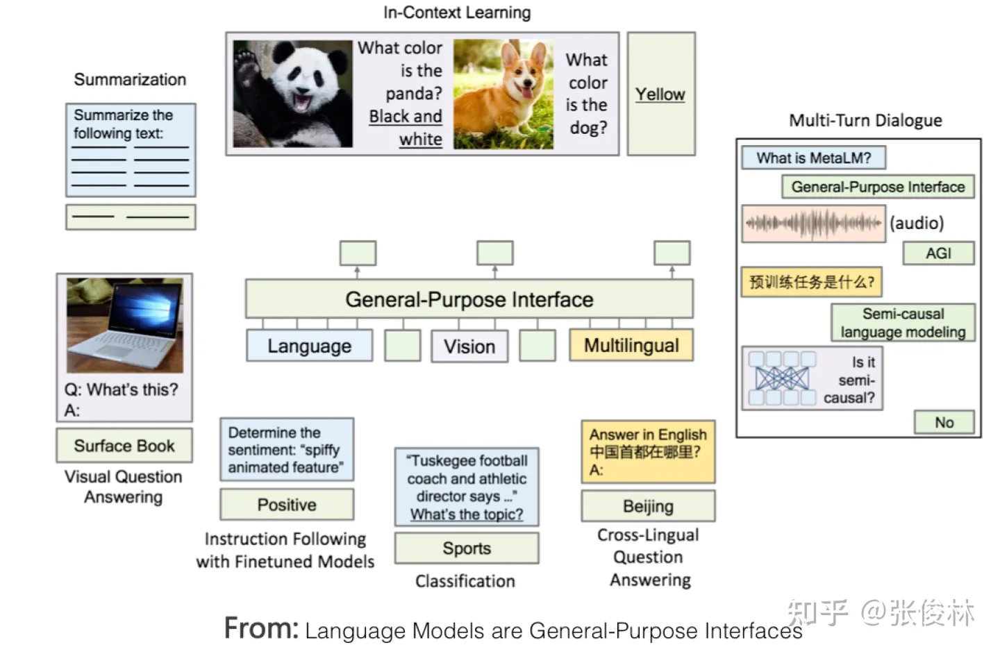
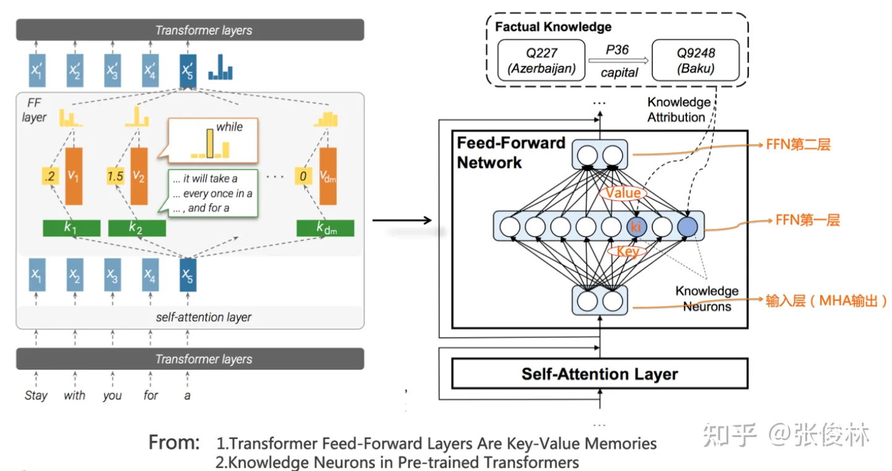
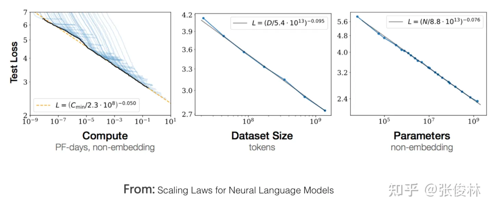
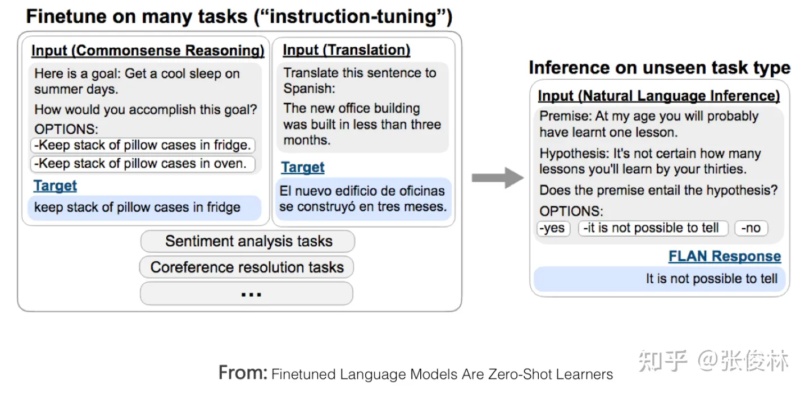
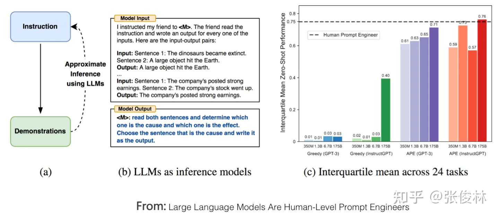
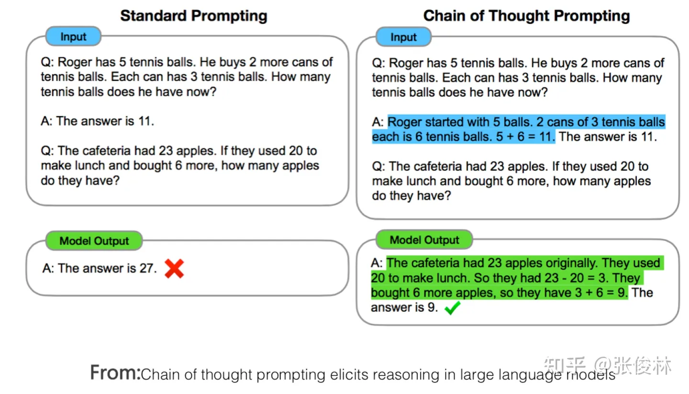
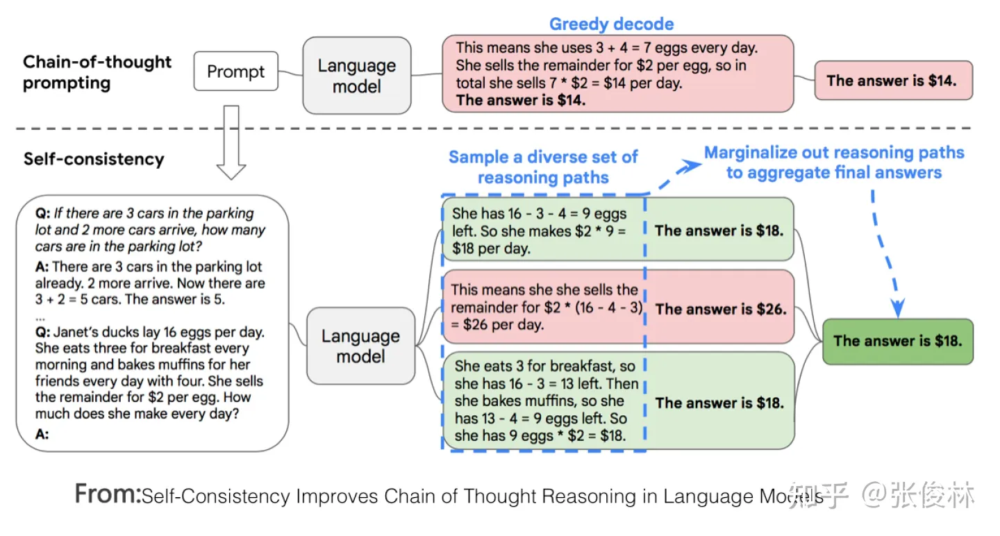
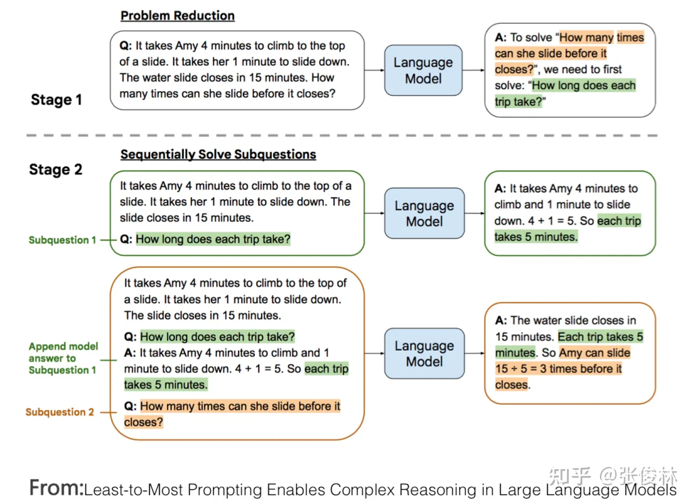
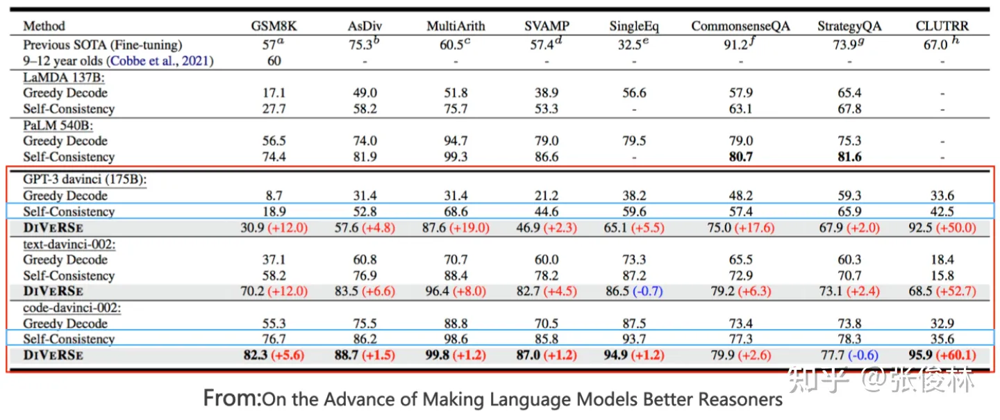
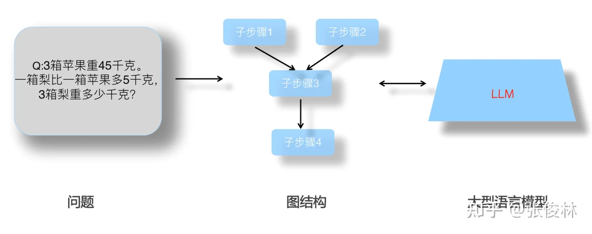

# 通向AGI之路：大型语言模型（LLM）技术精要

来源：https://zhuanlan.zhihu.com/p/597586623

发布于 2023-01-09 08:28・IP 属地北京

ChatGPT出现后惊喜或惊醒了很多人。惊喜是因为没想到大型语言模型（LLM,Large Language Model）效果能好成这样；惊醒是顿悟到我们对LLM的认知及发展理念，距离世界最先进的想法，差得有点远。我属于既惊喜又惊醒的那一批，也是典型的中国人，中国人善于自我反思，于是开始反思，而这篇文章正是反思的结果。

实话实说，国内在LLM模型相关技术方面，此刻，距离最先进技术的差距进一步加大了。技术领先或技术差距这事情，我觉得要动态地以发展的眼光来看。在Bert出现之后的一到两年间，其实国内在这块的技术追赶速度还是很快的，也提出了一些很好的改进模型，差距拉开的分水岭应该是在 GPT 3.0出来之后，也就是2020年年中左右。在当时，其实只有很少的人觉察到：GPT 3.0它不仅仅是一项具体的技术，其实体现的是LLM应该往何处去的一个发展理念。自此之后，差距拉得越来越远，ChatGPT只是这种发展理念差异的一个自然结果。所以，我个人认为，抛开是否有财力做超大型LLM这个因素，如果单从技术角度看，差距主要来自于对LLM的认知以及未来应往何处去的发展理念的不同。

国内被国外技术甩得越来越远，这个是事实，不承认也不行。前阵子网上很多人担忧说国内AI现在处于“危急存亡之秋”，我觉得倒也不至于这么严重。君不见，这个世界上，具备这么超前眼光的只有OpenAI一家吗？包括Google在内，其实对于LLM发展理念的理解，明显都落后OpenAI一个身位。现实是OpenAI表现过于优秀，把所有人都甩开了，不仅仅是国内。

我觉得，OpenAI对LLM在理念及相关技术方面，领先国外的Google、DeepMind大约半年到一年的时间，领先国内大概两年左右的时间。在LLM这个事情上，感觉梯队很明显，Google应该是排在第二位，最能体现Google技术眼光的是PaLM和Pathways，推出时间大概在22年2月到4月间，同一时期，OpenAI推出的却是InstructGPT，从这里就可以看出Google和OpenAI的差距了，至于为何这么说，你看了我后面的正文后大概能理解。DeepMind之前的重心一直在强化学习攻克游戏和AI for science这些方面，切入LLM其实很晚，应该是21年才开始重视这个方向，目前也处于追赶状态。Meta就更不用说了，重心一直不在LLM上，目前感觉也发力开始追赶。这还是目前做得最好的一批机构，尚且如此，更何况国内呢？我觉得情有可原。至于OpenAI关于LLM的理念是什么，我在本文的最后一部分，会谈谈我的认知。

本文梳理自GPT 3.0出现之后的主流LLM技术，在此之前的主流技术可以参考：

[乘风破浪的PTM：两年来预训练模型的技术进展](https://zhuanlan.zhihu.com/p/254821426)

我相信看完这两篇文章，能够让您对LLM领域的技术脉络，LLM技术发展过程中出现过的不同发展理念，乃至未来可能的发展趋势，有比较清晰的认知。当然，很多地方讲的内容是我个人看法，有很大的主观性，错漏难免，所以还请谨慎参考。

本文试图回答下面一些问题：ChatGPT是否带来了NLP乃至AI领域的研究范式转换？如果是，那会带来怎样的影响？LLM从海量数据中学到了什么知识？LLM又是如何存取这些知识的？随着LLM规模逐步增大，会带来什么影响？什么是In Context Learning?为什么它是一项很神秘的技术？它和Instruct又是什么关系？LLM具备推理能力吗？思维链CoT又是怎么做的？等等，相信看完，能让您对这些问题有一个答案。

首先，在谈LLM技术现状前，先宏观地谈下我心目中的研究范式转换问题。这样，我们才能“先见森林，再见树木”，对具体技术为何会是如此变化有个更清晰的认知。

## 潮流之巅：NLP研究范式的转换

如果我们把时间线往前拉得更长一些，回到NLP领域的深度学习时代，在更长时间窗口内观察技术变迁及其影响，可能会更容易看清其中的一些关键节点。我个人认为，在最近10年来NLP领域的技术发展过程中，可能存在两次大的研究范型转换。

### 范式转换1.0:从深度学习到两阶段预训练模型

这个范式转换所涵盖的时间范围，大致在深度学习引入NLP领域（2013年左右），到GPT 3.0出现之前（2020年5月左右）。

在Bert和GPT模型出现之前，NLP领域流行的技术是深度学习模型，而NLP领域的深度学习，主要依托于以下几项关键技术：以大量的改进LSTM模型及少量的改进CNN模型作为典型的特征抽取器；以Sequence to Sequence（或叫encoder-decoder亦可）+Attention作为各种具体任务典型的总体技术框架。

在这些核心技术加持下，NLP领域深度学习的主要研究目标，如果归纳一下，是如何有效增加模型层深或模型参数容量。就是说，怎么才能往encoder和decoder里不断叠加更深的LSTM或CNN层，来达成增加层深和模型容量的目标。这种努力，尽管确实不断增加了模型层深，但是从解决具体任务的效果角度看，总体而言，不算很成功，或者说和非深度学习方法相对，带来的优势不算大。

深度学习之所以不够成功，我认为主要原因来自于两个方面：一方面是某个具体任务有限的训练数据总量。随着模型容量的增加，需要靠更大量的训练数据来支撑，否则即使你能把深度做起来，任务效果也做不上去。而在预训练模型出现之前，很明显这是NLP研究领域一个严重问题；另外一个方面是LSTM／CNN特征抽取器，表达能力不够强。意思是就算给你再多的数据也没用，因为你不能有效地吸收数据里蕴含的知识。主要应该是这两个原因，阻碍了深度学习在NLP领域的成功突围。

Bert/GPT这两个预训练模型的出现，无论在学术研究角度看，还是工业应用角度来看，都代表了NLP领域的一个技术飞跃，并带来了整个领域研究范式的转换。这种范式转换带来的影响，体现在两个方面：首先，是部分NLP研究子领域的衰退乃至逐步消亡；其次，NLP不同子领域的技术方法和技术框架日趋统一，在Bert出现后一年左右，技术栈基本收敛到两种技术模式中。关于这两点，我们分头来谈。

#### 影响一：中间任务的消亡

NLP是一个宏观研究领域的统称，里面有五花八门具体的子领域与子方向，如果仔细分析，从任务的性质角度，可以把这些任务分成两大类：一类可以叫做“中间任务”，一类可以称为“最终任务”。

型的中间任务包括：中文分词、词性标注、NER、句法分析、指代消解、语义Parser等，这类任务一般并不解决应用中的实际需求，大多数是作为那些解决实际需求任务的中间阶段或者辅助阶段存在的，比如几乎没有需求说，我要一个句法Parser，把这个句子的句法分析树给用户看看，用户不需要看到这些NLP的中间阶段处理结果，他只关心某个具体任务你有没有干好。“最终任务”包括比如文本分类、文本相似性计算、机器翻译、文本摘要等等，有很多。这类任务的特点是每个子领域都解决某个实际需求，任务结果基本能直接呈现给用户，比如用户确实存在给你一句英文，告诉他中文是什么的需求。

按理说，**“中间任务”就不应该出现，而之所以会存在，这是NLP技术发展水平不够高的一种体现**。在技术发展早期阶段，因为当时的技术相对落后，很难一步做好有难度的最终任务。比如机器翻译，早期技术要做好机器翻译是很困难的，于是科研人员就把难题分而治之，分解成分词、词性标注、句法分析等各种中间阶段，先把每个中间阶段做好，然后再拼起来完成最终任务，这也是没办法的事情。

但是**自从Bert／GPT出现之后，其实就没有必要做这些中间任务了，因为通过大量数据的预训练，Bert／GPT已经把这些中间任务作为语言学特征，吸收到了Transformer的参数里**，此时我们完全可以端到端地直接解决那些最终任务，而无须对这种中间过程专门建模。这里可能争议最大的是中文分词，其实道理也是一样的，哪些字应该组成一个词，这个其实你不用管，让LLM自己当特征去学就行了，只要对于解决任务有帮助，它自然会去学该学的合理分词方式，也未必一定要和我们人类理解的分词规则相同。

基于以上认知，其实在Bert/GPT一出现，你就应该得出这类NLP的中间阶段的任务，会逐步退出历史舞台这个结论。

#### 影响二：不同研究方向技术路线的统一

在说明具体影响前，我们先讨论下另外一种NLP任务划分方式，这对于理解后面内容有帮助。如果对“最终任务”进一步进行分类，又大致可以分为两大不同类型的任务：自然语言理解类任务和自然语言生成类任务。如果排除掉“中间任务”的话，典型的自然语言理解类任务包括文本分类、句子关系判断、情感倾向判断等，这种任务本质上都是分类任务，就是说输入一个句子（文章），或者两个句子，模型参考所有输入内容，最后给出属于哪个类别的判断。自然语言生成也包含很多NLP研究子方向，比如聊天机器人、机器翻译、文本摘要、问答系统等。生成类任务的特点是给定输入文本，对应地，模型要生成一串输出文本。这两者的差异主要体现在输入输出形式上

自从Bert/GPT模型诞生后，出现了明显的技术统一趋向。首先，NLP中不同的子领域，其特征抽取器都逐渐从LSTM/CNN统一到Transformer上。其实，自Bert公开后不久，就应该意识到，这必然会成为技术趋势。至于其原因，在几年前我写的这篇：

[放弃幻想，全面拥抱Transformer：自然语言处理三大特征抽取器（CNN/RNN/TF）比较](https://zhuanlan.zhihu.com/p/54743941)

中做了说明和分析，感兴趣的同学可参考。而且，目前Transformer不仅统一了NLP诸多领域，也正在逐步地替换图像处理各种任务中被广泛使用的CNN等其它模型的进程之中，类似的，多模态模型目前也基本都采用了Transformer模型。这种Transformer从NLP出发，攻城略地逐步统一AI越来越多领域的趋势，起始于2020年底出现的Vision Transformer (ViT) ，之后蓬勃发展，到目前已大获成功，且其继续向更多领域拓展的势头会越来越迅猛。

其次，大多数NLP子领域的研发模式切换到了两阶段模式：模型预训练阶段+应用微调（Fine-tuning）或应用Zero／Few Shot Prompt模式。更准确地说，NLP各种任务其实收敛到了两个不同的预训练模型框架里：对于自然语言理解类任务，其技术体系统一到了以Bert为代表的“双向语言模型预训练+应用Fine-tuning”模式；而对于自然语言生成类任务，其技术体系则统一到了以GPT 2.0为代表的“自回归语言模型（即从左到右单向语言模型）+Zero /Few Shot Prompt”模式。至于为何会分化成两条技术路线，有其必然性，关于这点我们放在后面解释。

这两种模式，看似比较相像，但其背后蕴含了迥异的发展思路，也会导向不同的未来发展方向。不过遗憾的是，我们中的绝大多数人，在当时都低估了GPT 这条发展路线的潜力，而把视觉中心聚焦到了Bert这种模式上。

### 范式转换2.0: 从预训练模型走向通用人工智能 （AGI，Artificial General Intelligence）

这个范式转换所涵盖的时间范围，大致在GPT3.0出现之后（20年6月左右），一直到目前为止，我们应该正处于这个范式转换过程中。

ChatGPT是触发这次范型转换的关键节点，但是在InstructGPT出现之前，其实LLM处于这次范式转换前的一个过渡期。

#### 过渡期：以GPT 3.0为代表的“自回归语言模型+Prompting”模式占据统治地位

前面说过，在预训练模型发展的早期，技术框架收敛到了Bert模式和GPT模式这两种不同的技术范型，而且人们普遍更看好Bert模式一些，相当多数的后续技术改进，都是沿着Bert那条路走的。但是，随着技术的继续发展，你会发现，目前规模最大的LLM模型，几乎清一色都是类似GPT 3.0这种“自回归语言模型+Prompting”模式的，比如GPT 3、PaLM、GLaM、Gopher、Chinchilla、MT-NLG、LaMDA等，没有例外。为什么会这样呢？背后一定有其必然性，我认为可能主要源于两个原因。

首先，Google的T5模型，在形式上统一了自然语言理解和自然语言生成任务的外在表现形式。如上图所示，标为红色的是个文本分类问题，黄色的是判断句子相似性的回归或分类问题，这都是典型的自然语言理解问题。在T5模型里，这些自然语言理解问题在输入输出形式上和生成问题保持了一致，也就是说，可以把分类问题转换成让LLM模型生成对应类别的字符串，这样理解和生成任务在表现形式就实现了完全的统一。

这说明**自然语言生成任务，在表现形式上可以兼容自然语言理解任务，若反过来，则很难做到这一点**。这样的好处是：同一个LLM生成模型，可以解决几乎所有NLP问题。而如果仍然采取Bert模式，则这个LLM模型无法很好处理生成任务。既然这样，我们当然倾向于使用生成模型，这是一个原因。

第二个原因，**如果想要以零示例提示语（zero shot prompting）或少数示例提示语（few shot prompting）的方式做好任务，则必须要采取GPT模式**。现在已有研究（参考：On the Role of Bidirectionality in Language Model Pre-Training）证明：如果是以fine-tuning方式解决下游任务，Bert模式的效果优于GPT模式；若是以zero shot/few shot prompting这种模式解决下游任务，则GPT模式效果要优于Bert模式。这说明了，生成模型更容易做好zero shot/few shot prompting方式的任务，而Bert模式以这种方式做任务，是天然有劣势的。这是第二个原因。

但是问题来了：为什么我们要追求zero shot/few shot prompting这种方式来做任务呢？要解释清楚这个问题，我们首先需要搞清楚另外一个问题：什么样的LLM模型，对我们是最理想的？

上图展示了一个理想的LLM该有的样子。首先，LLM应该具备强大的自主学习能力。假设我们把世界上能获得的所有文本或者图片等不同类型的数据喂给它，它应该能够自动从中学习到里面包含的所有知识点，学习过程不需要人的介入，并且能灵活应用所学知识，来解决实际问题。因为数据是海量的，要吸收所有知识，就要非常多的模型参数来存储知识，所以这个模型必然会是一个巨无霸模型。

其次，LLM应该能解决NLP任何子领域的问题，而不仅支持有限领域，甚至它应该可以响应NLP之外其它领域的问题，最好是任意领域的问题都能得到很好地回答。

再者，当我们使用LLM解决某个具体领域问题的时候，应该用我们人类习惯的表达方式，就是说LLM应该理解人类的命令。这体现出让LLM适配人，而不是反过来，让人去适配LLM模型。人适配LLM的典型例子，比如绞尽脑汁去尝试各种不同的prompt，以试图找到好的提示语，才能很好地解决手头问题。关于这点，上图在人类和LLM交互的接口层，举了几个例子，说明什么是好的人使用LLM模型的接口形式。

看完这个理想中的LLM，我们再回头解释上面遗留的问题：为什么我们要追求zero shot/few shot prompting这种方式来做任务呢？有两个原因。

第一，这个LLM模型规模必然非常巨大，有能力作出这个模型，或改动这个模型参数的机构必然很少。而任务需求方是千千万万的中小机构甚至是个人，就算你把模型开源出来，他们也无力部署这个模型，更不用说再用Fine-tuning这种模式去修改模型参数了。所以，我们应该追求不修正模型参数，就能让任务需求方完成任务的方式，也就是应该采取prompt模式完成任务，而非Fine-tuning模式（由此可看出，soft prompting技术方向是违背这个发展趋势的）。模型制作方则将LLM作成公用服务，以LLM as Service的模式运行。作为服务支持方，考虑到千变万化的用户需求，所以LLM模型制作方更要追求让LLM能完成尽可能多类型的任务，这是附带的影响，也是为何超级大模型一定会追求走向AGI的现实因素。

第二，zero shot prompting也好，few shot prompting也好，甚至促进LLM推理能力的思维链（CoT,Chain of Thought）Prompting也好，就是上图中接口层中的现有技术。具体而言，zero shot prompting的初衷，其实就是人类和LLM的理想接口，直接用人类所习惯的任务表述方式让LLM做事情，但是发现LLM并不能很好地理解，效果也不好。经过继续研究，转而发现：对于某项任务，如果给LLM几个示例，用这些示例来代表任务描述，效果会比zero shot prompting好，于是大家都去研究更好的few shot prompting技术。可以理解为，本来我们希望LLM能够用人类常用的命令方式来执行某个任务，但是目前技术还做不到，所以退而求其次，用这些替代技术来表达人类的任务需求。

如果理解了上述逻辑，很容易得出如下结论：few shot prompting（也被称为In Context Learning）只是一种过渡时期的技术。如果我们能够更自然地去描述一个任务，而且LLM可以理解，那么，我们肯定会毫不犹豫地抛弃这些过渡期的技术，原因很明显，用这些方法来描述任务需求，并不符合人类的使用习惯。

这也是为何我将GPT 3.0+Prompting列为过渡期技术的原因，ChatGPT的出现，改变了这个现状，用Instruct取代了Prompting，由此带来新的技术范式转换，并产生若干后续影响。

#### 影响一：让LLM适配人的新型交互接口

在理想LLM的背景下，我们再来看ChatGPT，能更好理解它的技术贡献。ChatGPT应该是目前所有的现有技术里，最接近理想LLM的技术方法。如果归纳下ChatGPT最突出特点的话，我会用下面八个字：“能力强大，善解人意”。

“能力强大”这一点，我相信应该主要归功于ChatGPT所依托的基础LLM GPT3.5。因为ChatGPT 尽管加入了人工标注数据，但是量级只有数万，这个规模的数据量，和训练GPT 3.5模型使用的几千亿token级别的数据量相比，包含的世界知识（数据中包含的事实与常识）可谓沧海一粟，几可忽略，基本不会对增强GPT 3.5的基础能力发挥什么作用。所以它的强大功能，应该主要来自于隐藏在背后的GPT 3.5。GPT 3.5对标理想LLM模型中的那个巨无霸模型。

那么，ChatGPT向GPT 3.5模型注入新知识了吗？应该是注入了，这些知识就包含在几万人工标注数据里，不过注入的不是世界知识，而是人类偏好知识。所谓“人类偏好”，包含几方面的含义：首先，是人类表达一个任务的习惯说法。比如，人习惯说：“把下面句子从中文翻译成英文”，以此表达一个“机器翻译”的需求，但是LLM又不是人，它怎么会理解这句话到底是什么意思呢？你得想办法让LLM理解这句命令的含义，并正确执行。所以，ChatGPT通过人工标注数据，向GPT 3.5注入了这类知识，方便LLM理解人的命令，这是它“善解人意”的关键。其次，对于什么是好的回答，什么是不好的回答，人类有自己的标准，例如比较详细的回答是好的，带有歧视内容的回答是不好的，诸如此类。这是人类自身对回答质量好坏的偏好。人通过Reward Model反馈给LLM的数据里，包含这类信息。总体而言，ChatGPT把人类偏好知识注入GPT 3.5，以此来获得一个听得懂人话、也比较礼貌的LLM。

可以看出，ChatGPT的最大贡献在于：基本实现了理想LLM的接口层，让LLM适配人的习惯命令表达方式，而不是反过来让人去适配LLM，绞尽脑汁地想出一个能Work的命令（这就是instruct技术出来之前，prompt技术在做的事情），而这增加了LLM的易用性和用户体验。是InstructGPT/ChatGPT首先意识到这个问题，并给出了很好的解决方案，这也是它最大的技术贡献。相对之前的few shot prompting，它是一种更符合人类表达习惯的人和LLM进行交互的人机接口技术。

而这必将启发后续的LLM模型，继续在易用人机接口方面做进一步的工作，让LLM更听话。

#### 影响二：很多NLP子领域不再具备独立研究价值

就NLP领域而言，这次范式转换，意味着很多目前独立存在的NLP研究领域，将被纳入LLM的技术体系，进而不再独立存在，逐步消失。经过第一次范式转换，尽管NLP中很多“中间任务”，继续作为独立研究领域存在不再必要，但是大多数“最终任务”，仍然是以独立研究领域存在的，只是切换成在“预训练+fine-tuning”框架下，面对领域独有问题，陆续提出新的改进方案。

目前研究表明，很多NLP任务，随着LLM模型规模增长，效果会大幅提升。据此，我觉得可得到如下推论：大多数某领域所谓“独有”的问题，大概率只是缺乏领域知识导致的一种外在表象，只要领域知识足够多，这个所谓领域独有的问题，就可以被很好地解决掉，其实并不需要专门针对某个具体领域问题，冥思苦想去提出专用解决方案。也许AGI的真相超乎意料地简单：你只要把这个领域更多的数据交给LLM，让它自己学习更多知识即可。

在这个背景下，同时，ChatGPT证明了我们现在是可以直接去追求理想LLM模型的，那么，未来的技术发展趋势应该是：追求规模越来越大的LLM模型，通过增加预训练数据的多样性，来涵盖越来越多的领域，LLM自主从领域数据中通过预训练过程学习领域知识，随着模型规模不断增大，很多问题随之得到解决。研究重心会投入到如何构建这个理想LLM模型，而非去解决某个领域的具体问题。这样，越来越多NLP的子领域会被纳入LLM的技术体系，进而逐步消失。

我认为，判断某个具体领域是否该立即停止独立研究，其判断标准可采取以下两种方法，占其一即可：第一，判断某个任务，是否LLM的研究效果超过人类表现，对于那些LLM效果超过人类的研究领域，已无独立研究的必要。举个例子，GLUE与SuperGLUE测试集合里的很多任务，目前LLM效果已超过人类表现，与这个数据集合密切相关的研究领域，其实就没有继续独立存在的必要。第二，对比两种模式的任务效果，第一种模式是用较大的领域专用数据进行Fine-tuning，第二种是few-shot prompting或instruct-based方法。如果第二种方法效果达到或超过第一种方法，则意味着这个领域没有继续独立存在的必要性。如果用这个标准来看，其实很多研究领域，目前fine-tuning效果还是占优的（因为这种模式领域训练数据量大），看似还可独立存在。但是考虑到很多任务随着模型规模增大，few shot prompting效果持续增长，随着更大模型的出现，这个拐点很可能短期就会达到。

如果上述猜测成立，将意味着如下残酷事实：对于很多NLP领域的研究人员，将面临往何处去的选择，是继续做领域独有问题呢？还是放弃这种看似前途不大的方式，转而去建设更好的LLM？如果选择转向去建设LLM，又有哪些机构有能力、有条件去做这个事情呢？你对这个问题的回答会是什么呢？

#### 影响三：更多NLP之外的研究领域将被纳入LLM技术体系

如果站在AGI的视角，参照之前描述的理想LLM模型，它所能完成的任务，不应局限于NLP领域，或某一两个学科领域，理想中的LLM应该是领域无关的通用人工智能模型，它现在在某一两个领域做得好，不代表只能做这些任务。ChatGPT的出现，证明了现在这个时期，我们去追求AGI是有可行性的，而现在是抛开“领域学科”这个思维束缚的时候了。

ChatGPT除了展示出以流畅的对话形式解决各种NLP任务外，也具备强大的代码能力。很自然的，之后越来越多其它的研究领域，也会被逐步纳入LLM体系中，成为通用人工智能的一部分。

LLM从NLP向外进行领域拓展，一个自然的选择就是图像处理及多模态相关任务。目前已经有些工作在尝试把多模态融入，让LLM成为一个支持多模态输入输出的通用人机接口，典型的例子包括DeepMind的Flamingo和微软的“Language Models are General-Purpose Interfaces”，上图展示了这种方式的概念结构。

我的判断是无论是图像还是多模态，未来被融入LLM成为好用的功能，可能比我们想象的进度要慢。主要原因在于：尽管图像领域最近两年也一直在模仿Bert预训练的路子，尝试引入自监督学习，释放模型自主从图像数据中学习知识的能力，典型技术就是“对比学习”和MAE，这是两条不同的技术路线。然而，从目前效果来看，尽管取得了很大的技术进步，但貌似这条路尚未走通，这体现在图像领域预训练模型应用到下游任务，带来的效果收益，远不如Bert或GPT应用在NLP下游任务那样显著。所以，图像预处理模型仍需深入探索，以释放图像数据的潜力，而这会迟滞它们被统一到LLM大模型的时间。当然，如果哪天这条路被趟通，大概率会复现NLP领域目前的局面，就是图像处理各个研究子领域可能会逐步消失，被融入到大型LLM中来，直接完成终端任务。

除了图像与多模态，很明显，其它领域也会逐渐被纳入到理想LLM中来，这个方向方兴未艾，是具备高价值的研究主题。

以上是我对范式转换的个人思考，接下来，我们来梳理下GPT 3.0之后LLM模型的主流技术进展。如理想LLM模型所示，相关的技术其实可以分为两大类；一类是关于LLM模型如何从数据中吸收知识，也包括模型规模增长对LLM吸收知识能力带来的影响；第二类是关于人如何使用LLM内在能力来解决任务的人机接口，包括In Context Learning和Instruct两种模式。思维链（CoT）prompting这种LLM推理技术，本质上也属于In Context Learning，因为比较重要，我就把它们单独拎出来讲一下。

## 学习者：从无尽数据到海量知识

从目前研究结果看，Transformer是足够强大的特征抽取器，尚不需要做特别的改进。那么通过预训练过程，Transformer学到了什么？知识是如何存取的？我们又如何修正错误知识？本节讲述这方面的研究进展。

### 求知之路：LLM学到了什么知识

LLM从海量自由文本中学习了大量知识，如果把这些知识做粗略分类的话，可以分为语言类知识和世界知识两大类。

语言类知识指的是词法、词性、句法、语义等有助于人类或机器理解自然语言的知识。关于LLM能否捕获语言知识有较长研究历史，自从Bert出现以来就不断有相关研究，很早就有结论，各种实验充分证明LLM可以学习各种层次类型的语言学知识，这也是为何使用预训练模型后，各种语言理解类自然语言任务获得大幅效果提升的最重要原因之一。另外，各种研究也证明了浅层语言知识比如词法、词性、句法等知识存储在Transformer的低层和中层，而抽象的语言知识比如语义类知识，广泛分布在Transformer的中层和高层结构中。

世界知识指的是在这个世界上发生的一些真实事件（事实型知识，Factual Knowledge），以及一些常识性知识(Common Sense Knowledge)。比如“拜登是现任美国总统”、“拜登是美国人”、“乌克兰总统泽连斯基与美国总统拜登举行会晤”，这些都是和拜登相关的事实类知识；而“人有两只眼睛”、“太阳从东方升起”这些属于常识性知识。关于LLM模型能否学习世界知识的研究也有很多，结论也比较一致：LLM确实从训练数据中吸收了大量世界知识，而这类知识主要分布在Transformer的中层和高层，尤其聚集在中层。而且，随着Transformer模型层深增加，能够学习到的知识数量逐渐以指数级增加（可参考：BERTnesia: Investigating the capture and forgetting of knowledge in BERT）。其实，你把LLM看作是一种以模型参数体现的隐式知识图谱，如果这么理解，我认为是一点问题也没有的。

“When Do You Need Billions of Words of Pre-training Data?”这篇文章研究了预训练模型学习到的知识量与训练数据量的关系，它的结论是：对于Bert类型的语言模型来说，只用1000万到1亿单词的语料，就能学好句法语义等语言学知识，但是要学习事实类知识，则要更多的训练数据。这个结论其实也是在意料中的，毕竟语言学知识相对有限且静态，而事实类知识则数量巨大，且处于不断变化过程中。而目前研究证明了随着增加训练数据量，预训练模型在各种下游任务中效果越好，这说明了从增量的训练数据中学到的更主要是世界知识。

### 记忆之地：LLM如何存取知识

由上可知，LLM确实从数据中学到了很多语言类及世界知识。那么，对于某条具体的知识，LLM把它存储到了哪里？又是如何提取出来的？这也是一个有意思的问题。

显然，知识一定存储在Transformer的模型参数里。从Transformer的结构看，模型参数由两部分构成：**多头注意力（MHA）部分占了大约参数总体的三分之一，三分之二的参数集中在FFN结构中。MHA主要用于计算单词或知识间的相关强度，并对全局信息进行集成，更可能是在建立知识之间的联系，大概率不会存储具体知识点，那么很容易推论出LLM模型的知识主体是存储在Transformer的FFN结构里**。

但这样的定位，粒度还是太粗，无法很好回答具体某条知识是如何存储与提取的，比如 “中国的首都是北京”这条知识，以三元组表达就是<北京，is-capital-of，中国>，其中“is-capital-of”代表实体间关系。这条知识它存储在LLM的哪里呢？

“Transformer Feed-Forward Layers Are Key-Value Memories”给出了一个比较新颖的观察视角，它把Transformer的FFN看成存储大量具体知识的Key-Value存储器。如上图所示（图左是原始论文图，其实不太好理解，可以看做了注释的图右，更好理解些），FFN的第一层是个MLP宽隐层，这是Key层；第二层是MLP窄隐层，是Value层。FFN的输入层其实是某个单词对应的MHA的输出结果Embedding，也就是通过Self Attention，将整个句子有关的输入上下文集成到一起的Embedding，代表了整个输入句子的整体信息。

Key层的每个神经元节点，记载了一对<Key,Value>信息。比如对于上图中FFN第一个隐层的第 i 个节点 ki ，也许就是它记载了<北京，is-capital-of，中国>这条知识。 ki 节点对应的key向量，其实指的是节点 ki 和输入层每个节点的权重向量；而对应的Value向量，指的是节点 ki 和FFN第二层的Value层每个节点形成连接的权重向量。每个神经元的Key向量，用于识别输入中的某种语言或者知识模式，是一种模式探测器。如果输入中包含它要检测的某种模式，那么输入向量和 ki 节点的key权重进行向量内积计算，加上Relu，形成 ki 的大数值响应，意味着 ki 检测到了这个模式，于是再把这个响应值，通过 ki 节点的Value权重向量向FFN第二层传播。这等价于将Value向量的值，用响应值加权，然后传递并体现到第二层Value层每个节点的输出上。如此这般，FFN的正向传播计算过程，看起来就像是通过Key检测到某种知识模式，然后取出对应的Value，并把Value体现在FFN的第二层输出上。当然，FFN第二层每个节点，会收集FFN的Key层所有节点信息，所以是一种混合响应，而Value层所有节点的混合响应，可以解读为代表输出单词的概率分布信息。

听着可能还是比较复杂，我们用个极端的例子来说明。我们假设上图的节点 ki 就是记载<北京，is-capital-of，中国>这条知识的Key-Value存储器，它的Key向量，用于检测”中国的首都是…”这个知识模式，它的Value向量，基本存储了与单词“北京”的Embedding比较接近的向量。当Transformer的输入是“中国的首都是[Mask]”的时候， ki 节点从输入层探测到这个知识模式，所以产生较大的响应输出。我们假设Key层其它神经元对这个输入都没有任何响应，那么对应的Value层的节点，其实只会接收到“北京”这个Value对应的单词embedding，并通过 ki 的大响应值，进行了进一步的数值放大。于是，Mask位置对应的输出，就自然会输出“北京”这个单词。基本就是这么个过程，看着很复杂，其实很简单。

而且这篇文章还指出，Transformer低层对句子的表层模式作出反应，高层对语义模式作出反应，就是说低层FFN存储词法、句法等表层知识，中层和高层存储语义及事实概念知识，这和其它研究结论是一致的。

要我猜，把FFN看成Key-Value存储器这种思路，很可能不是最终的正确答案，但是距离最终正确答案的距离，估计也不太远。

### 知识涂改液：如何修正LLM里存储的知识

既然我们已知具体的某条世界知识存储在某个或者某些FFN节点的参数里，自然会引发另外一个问题：我们能否修正LLM模型里存储的错误或者过时的知识呢？比如对于问题：“英国的现任首相是谁？”鉴于近年来英国首相频繁更迭，你猜LLM更倾向输出“鲍里斯”还是更青睐“苏纳克”？很明显训练数据中包含“鲍里斯”的数据会更多，这种情况很大可能LLM会给出错误回答，于是我们就有修正LLM里存储的过时知识的必要性。

如果归纳下，目前有三类不同方法来修正LLM里蕴含的知识：

**第一类方法从训练数据的源头来修正知识**。“Towards Tracing Factual Knowledge in Language Models Back to the Training Data”这篇文章的研究目标是：对于指定的某条知识，我们是否可以定位到是哪些训练数据导致LLM学会了这条知识？答案是肯定的，这意味着我们可以逆向追踪到某条知识对应的训练数据源头。如果利用这项技术，假设我们想要删除某条知识，则可首先定位到其对应的数据源头，删除数据源，然后重新预训练整个LLM模型，这样即可达成删除LLM中相关知识的目的。但是这里有个问题，如果修正一小部分知识，我们就需要重新做一次模型预训练，这样做明显成本太高。所以这种方法不会太有发展前景，可能比较适合那种对于某个特定类别数据的一次性大规模删除场合，不适合少量多次的常规知识修正场景，比如可能比较适合用来做去除偏见等去toxic内容的处理。

**第二类方法是对LLM模型做一次fine-tuning来修正知识**。一个直观能想到的方法是：我们可以根据要修正成的新知识来构建训练数据，然后让LLM模型在这个训练数据上做fine-tuning，这样指导LLM记住新的知识，遗忘旧的知识。这个方法简单直观，但是也有一些问题，首先它会带来灾难遗忘问题，就是说除了忘掉该忘的知识，还忘掉了不该忘的知识，导致这么做了之后有些下游任务效果下降。另外，因为目前的LLM模型规模非常大，即使是做fine-tuning，如果次数频繁，其实成本也相当高。对这种方法感兴趣的可以参考“Modifying Memories in Transformer Models”。

**另外一类方法直接修改LLM里某些知识对应的模型参数来修正知识**。假设我们想要把旧知识<英国，现任首相，鲍里斯>，修正到<英国，现任首相，苏纳克>。首先我们想办法在LLM模型参数中，定位到存储旧知识的FFN节点，然后可以强行调整更改FFN中对应的模型参数，将旧知识替换成新的知识。可以看出，这种方法涉及到两项关键技术：**首先是如何在LLM参数空间中定位某条知识的具体存储位置；其次是如何修正模型参数，来实现旧知识到新知识的修正**。关于这类技术的细节，可以参考“Locating and Editing Factual Associations in GPT”和“Mass-Editing Memory in a Transformer”。理解这个修正LLM知识的过程，其实对于更深入理解LLM的内部运作机制是很有帮助的。

## 规模效应：当LLM越来越大时会发生什么

我们知道，近年来，LLM模型规模在快速增长，目前效果最好的LLM模型，其参数规模大都超过了千亿（100B）参数规模。比如，OpenAI的GPT 3的规模为175B，Google的LaMDA规模为137B，PaLM的规模为540B，DeepMind的Gogher规模为280B等，不一而足。国内也有中文巨型模型，比如清华&智谱GLM规模130B，华为“盘古”规模200B，百度“文心”规模260B，浪潮“源1.0”规模245B。那么，一个很自然的问题就是：随着LLM模型规模不断增长，会发生些什么呢？

预训练模型的应用往往是两阶段的：预训练阶段，及具体场景应用阶段。在预训练阶段，其优化目标是交叉熵，对GPT这种自回归语言模型来说，也就是看LLM是否正确预测到了下一个单词；而场景应用阶段，一般要看具体场景的评价指标。一般我们的直觉是：如果LLM模型在预训练阶段的指标越好，自然它解决下游任务的能力就越强。然而，事实并非完全如此。现有研究已证明，预训练阶段的优化指标确实和下游任务表现出正相关关系，但是并非完全正相关。也就是说，只看预训练阶段的指标，来判断一个LLM模型是否够好，这是不够的。基于此，我们分头来看在这两个不同阶段，随着LLM模型增大，有什么影响。

首先，我们先看在预训练阶段，随着模型规模逐步增大，会发生什么。OpenAI在“Scaling Laws for Neural Language Models”中专门研究了这个问题，并提出LLM模型所遵循的“伸缩法则”（scaling law）。如上图所示，这个研究证明：当我们独立增加训练数据量、模型参数规模或者延长模型训练时间（比如从1个Epoch到2个Epoch），预训练模型在测试集上的Loss都会单调降低，也就是说模型效果越来越好。

**既然三个因素都重要，那么我们在实际做预训练的时候，就有一个算力如何分配的决策问题**：假设用于训练LLM的算力总预算（比如多少GPU小时或者GPU天）给定，那么是应该多增加数据量、减少模型参数呢？还是说数据量和模型规模同时增加，减少训练步数呢？此消彼长，某个要素规模增长，就要降低其它因素的规模，以维持总算力不变，所以这里有各种可能的算力分配方案。最终OpenAI选择了同时增加训练数据量和模型参数，但是采用早停策略(early stopping)来减少训练步数的方案。因为它证明了：对于训练数据量和模型参数这两个要素，如果只单独增加其中某一个，这不是最好的选择，最好能按照一定比例同时增加两者，**它的结论是优先增加模型参数，然后才是训练数据量**。假设用于训练LLM的算力总预算增加了10倍，那么应该增加5.5倍的模型参数量，1.8倍的训练数据量，此时模型效果最佳。

DeepMind的一项研究（参考：Training Compute-Optimal Large Language Models）更深入地探究了这个问题，其基本结论和OpenAI的结论差不多，比如确实**需要同时增加训练数据量和模型参数，模型效果才会更好**。而很多大模型在做预训练的时候，并没有考虑这一点，很多LLM大模型只是单调增加模型参数，而固定住了训练数据量，这个做法其实是不对的，限制了LLM模型的潜力。但是它修正了两者的比例关系，认为训练数据量和模型参数是同等重要的，也就是说，假设用于训练LLM的算力总预算增加了10倍，那么应该增加3.3倍的模型参数量，3.3倍的训练数据量，这样模型效果才最好。

这意味着：增加训练数据量的重要性，比我们之前所认为的，还要重要。基于这个认知，DeepMind在设计Chinchilla模型时，在算力分配上选择了另外一种配置：对标数据量300B、模型参数量280B的Gopher模型，Chinchilla选择增加4倍的训练数据，但是将模型参数降低为Gopher的四分之一，大约为70B。但是无论预训练指标，还是很多下游任务指标，Chinchilla效果都要优于规模更大的Gopher。

这带给我们如下启示：我们可以选择放大训练数据，并同比例地减少LLM模型参数，以达到在不降低模型效果的前提下，极大缩小模型规模的目的。缩小模型规模有很多好处，比如在应用的时候，推理速度会快很多等，无疑这是一个很有前途的LLM发展路线。

以上是从预训练阶段来看模型规模的影响，如果从LLM解决下游具体任务效果的角度来看，随着模型规模增大，不同类型的任务有不同的表现，具体而言，有以下三类情况。

第一类任务完美体现了LLM模型的scaling law，就是说**随着模型规模逐步放大，任务的表现越来越好**，如上图里的（a）图所示。这类任务通常符合如下共性：它们往往都是知识密集型任务，也就是说如果LLM模型包含的知识量越多，这类任务表现越好。而很多研究已经证明越大的LLM模型学习效率越高，也就是说相同训练数据量，模型越大任务效果越好，说明面对的即使是同样的一批训练数据，更大的LLM模型相对规模小一些的模型，从中学到了更多的知识。更何况一般情况下，在增大LLM模型参数的时候，往往会同步增加训练数据量，这意味着大模型可以从更多数据中学习更多的知识点。这些研究可以很好地解释上图，为何随着模型规模增大，这些知识密集型的任务效果越来越好。大多数传统的自然语言理解类任务，其实都属于这种知识密集型任务，而很多任务在近两年获得了极大的效果提升，甚至超过了人类表现。很明显，这大概率是LLM模型的规模增长带来的，而非归功于某项具体的技术改进。

第二类任务展现出LLM具备某种“涌现能力（Emergent Ability）”，如上图（b）所示。所谓“涌现能力”，指的是**当模型参数规模未能达到某个阀值时，模型基本不具备解决此类任务的任何能力，体现为其性能和随机选择答案效果相当，但是当模型规模跨过阀值，LLM模型对此类任务的效果就出现突然的性能增长**。也就是说，模型规模是解锁(unlock)LLM新能力的关键，随着模型规模越来越大，会逐渐解锁LLM越来越多的新能力。这是个很神奇的现象，因为它意味着如下让人对未来可报乐观预期的可能：或许很多任务，目前LLM还不能很好地解决，甚至站在现在这个时刻的我们看起来，LLM完全没有能力解决这类任务，但因LLM具备“涌现能力”，所以如果我们继续推大模型，也许某一天它的这项能力就被突然解锁了。LLM模型的规模增长会给我们带来意想不到的精彩礼物。

“Beyond the Imitation Game: Quantifying and extrapolating the capabilities of language models”这篇文章指出，这类体现出“涌现能力”的任务也有一些共性：这些任务一般由多步骤构成，要解决这些任务，往往需要先解决多个中间步骤，而逻辑推理能力在最终解决这类任务中发挥重要作用。思维链（Chain of Thought）Prompting是典型的增强LLM推理能力的技术，能大幅提升此类任务的效果，关于CoT技术，在随后小节内容会做解释，此处暂不展开。

问题是，为何LLM会出现这种“涌现能力”现象呢？上述文章以及“Emergent Abilities of Large Language Models”给出了几个可能的解释：

一种可能解释是有些任务的评价指标不够平滑。比如说有些生成任务的判断标准，它要求模型输出的字符串，要和标准答案完全匹配才算对，否则就是0分。所以，即使随着模型增大，其效果在逐步变好，体现为输出了更多的正确字符片段，但是因为没有完全对，只要有任何小错误都给0分，只有当模型足够大，输出片段全部正确才能得分。也就是说，因为指标不够平滑，所以不能体现LLM其实正在逐步改善任务效果这一现实，看起来就是“涌现能力”这种外在表现。

另外一种可能的解释是：有些任务由若干中间步骤构成，随着模型规模增大，解决每个步骤的能力也在逐步增强，但是只要有一个中间步骤是错的，最终答案就是错的，于是也会导致这种表面的“涌现能力”现象。

当然，上面的解释目前还都是猜想，至于为何LLM会出现这种现象，还需要进一步更深入的研究。

**还有少部分任务，随着模型规模增长，任务的效果曲线展现出U形特性：随着模型规模逐渐变大，任务效果逐渐变差，但是当模型规模进一步增长，则效果开始越来越好，呈现出U形增长趋势**，如上图所示的粉红色PaLM模型在两个任务上的指标走势。为何这些任务表现得如此特殊呢？“Inverse scaling can become U-shaped”这篇文章给出了一种解释：这些任务，内部其实隐含了两种不同类型的子任务，一种是真正的任务，另外一种是“干扰任务（distractor task）”。当模型规模小的时候，无法识别任意一种子任务，所以模型的表现跟随机选择答案差不多，当模型增长到中等规模的时候，主要执行的是干扰任务，所以对真正的任务效果有负面影响，体现为真正任务效果的下降，而当进一步增加模型规模，则LLM可以忽略干扰任务，执行真正的任务，体现为效果开始增长。

对于那些随着模型规模增大，效果一直下降的任务，如果采用思维链（CoT）Prompting，则部分任务的表现转换为遵循Scaling law，即模型规模越大效果越好，而其它任务则转换为U性增长曲线。这其实侧面说明了：此类任务应属于推理类型的任务，所以加入CoT后任务表现会发生质的变化。

## 人机接口:从In Context Learning到Instruct理解

一般我们经常提到的人和LLM的接口技术包括：zero shot prompting、few shot prompting、In Context Learning，以及Instruct。这些其实都是表达某个具体任务的描述方式。不过如果你看文献，会发现叫法比较乱。

其中Instruct 是ChatGPT的接口方式，就是说人以自然语言给出任务的描述，比如“把这个句子从中文翻译成英文”，类似这种。zero shot prompting我理解其实就是现在的Instruct的早期叫法，以前大家习惯叫zero shot，现在很多改成叫Instruct。尽管是一个内涵，但是具体做法是两种做法。早期大家做zero shot prompting，实际上就是不知道怎么表达一个任务才好，于是就换不同的单词或者句子，反复在尝试好的任务表达方式，这种做法目前已经被证明是在拟合训练数据的分布，其实没啥意思。目前Instruct的做法则是给定命令表述语句，试图让LLM理解它。所以尽管表面都是任务的表述，但是思路是不同的。

而In Context Learning和few shot prompting意思类似，就是给LLM几个示例作为范本，然后让LLM解决新问题。我个人认为In Context Learning也可以理解为某项任务的描述，只是Instruct是一种抽象的描述方式，In Context Learning是一种例子示范的例子说明法。当然，鉴于目前这几个叫法用的有点乱，所以上述理解仅代表个人看法。

所以我们此处只对In Context Learning和Instruct进行介绍，不再提zero shot和few shot了。

### 神秘的In Context Learning

如果你细想，会发现In Context Learning是个很神奇的技术。它神奇在哪里呢？神奇在你提供给LLM几个样本示例 <x1,y1>,<x2,y2>....<xn,yn> ，然后给它 xn+1 ，LLM竟然能够成功预测对应的 yn+1 。听到这你会反问：这有什么神奇的呢？Fine-tuning不就是这样工作的吗？你要这么问的话，说明你对这个问题想得还不够深入。

Fine-tuning和In Context Learning表面看似都提供了一些例子给LLM，但两者有质的不同（参考上图示意）：Fine-tuning拿这些例子当作训练数据，利用反向传播去修正LLM的模型参数，而修正模型参数这个动作，确实体现了LLM从这些例子学习的过程。**但是，In Context Learning只是拿出例子让LLM看了一眼，并没有根据例子，没有用反向传播去修正LLM模型参数的动作，就要求它去预测新例子**。既然没有修正模型参数，这意味着貌似LLM并未经历一个学习过程，如果没有经历学习过程，那它为何能够做到仅看一眼，就能预测对新例子呢？这正是In Context Learning的神奇之处。这是否让你想起了一句歌词：“只是因为在人群中多看了你一眼 再也没能忘掉你容颜”，而这首歌名叫“传奇”。你说传奇不传奇？

看似In Context Learning没从例子里学习知识，实际上，难道LLM通过一种奇怪的方式去学习？还是说，它确实也没学啥？关于这个问题的答案，目前仍是未解之谜。现有一些研究各有各的说法，五花八门，很难判断哪个讲述的是事实的真相，甚至有些研究结论还相互矛盾。这里提供几个目前的说法，至于谁对谁错，只能你自己把握了。当然，我认为追求这个神奇现象背后的真相，是一个好的研究课题。

试图证明In Context Learning没有从例子中学习的工作是“Rethinking the Role of Demonstrations: What Makes In-Context Learning Work?”。它发现了：在提供给LLM的样本示例 <xi,yi> 中， yi 是否 xi 对应的正确答案，其实并不重要，如果我们把正确答案 yi 替换成随机的另外一个答案 yj ，这并不影响In Context Learning的效果。这起码说明了一点：In Context Learning并没有提供给LLM那个从 x 映射到 y 的映射函数信息： y=f(x) ，否则的话你乱换正确标签，肯定会扰乱这个 y=f(x) 映射函数。也就是说，**In Context Learning并未学习这个输入空间到输出空间的映射过程**。

**真正对In Context Learning影响比较大的是： x 和 y 的分布，也就是输入文本 x 的分布和候选答案 y 有哪些，如果你改变这两个分布，比如把 y 替换成候选答案之外的内容，则In Context Learning效果急剧下降**。

总之，**这个工作证明了In Context Learning并未学习映射函数，但是输入和输出的分布很重要**，这两个不能乱改。

有些工作认为LLM还是从给出的示例学习了这个映射函数 y=f(x) ，不过是种隐式地学习。比如“What learning algorithm is in-context learning? Investigations with linear models”认为Transformer能够隐式地从示例中学习 x 到 y 的映射过程，它的激活函数中包含了一些简单映射函数，而LLM通过示例能够激发对应的那一个。而“Why Can GPT Learn In-Context? Language Models Secretly Perform Gradient Descent as Meta-Optimizers”这篇文章则将ICL看作是一种隐式的Fine-tuning。

总而言之，目前这还是一个未解之谜。

### 神奇的Instruct理解

我们可以把Instruct当作一种方便人类理解的任务表述，在这个前提下，目前关于Instruct的研究可以分成两种：偏学术研究的Instruct，以及关于人类真实需求描述的Instruct。

我们先来看第一种：偏学术研究的Instruct。它的核心研究主题是多任务场景下，LLM模型对Instruct理解的泛化能力。如上图中FLAN模型所示，就是说有很多NLP任务，对于每个任务，研究人员构造一个或者多个Prompt模版作为任务的Instruct，然后用训练例子对LLM模型进行微调，让LLM以同时学习多个任务。**训练好模型后，给LLM模型一个它没见过的全新任务的Instruct，然后让LLM 解决zero shot任务，从任务解决得是否足够好，来判断LLM模型是否有对Instruct理解的泛化能力**。

如果归纳下目前的研究结论（可参考“Scaling Instruction-Fine-tuned Language Models”／“Super-NaturalInstructions: Generalization via Declarative Instructions on 1600+ NLP Tasks”），能够有效增加LLM模型Instruct泛化能力的因素包括：增加多任务的任务数量、增加LLM模型大小、提供CoT Prompting， 以及增加任务的多样性。如果采取任意一项措施，都可以增加LLM模型的Instruct理解能力。

第二种是**人类真实需求下的Instruct**，这类研究以InstructGPT和ChatGPT为代表。这类工作也是基于多任务的，但是和偏向学术研究类工作最大的不同，在于它是面向人类用户真实需求的。为什么这么说呢？因为它们用于LLM多任务训练的任务描述Prompt，是从大量用户提交的真实请求中抽样而来的，而不是固定好研究任务的范围，然后让研究人员来写任务描述prompt。这里所谓的“真实需求”，体现在两个方面：首先，因为是从用户提交的任务描述里随机抽取的，所以涵盖的任务类型更多样化，也更符合用户的真实需求；其次，某个任务的prompt描述，是用户提交的，体现了一般用户在表达任务需求时会怎么说，而不是你认为用户会怎么说。很明显，这类工作改出来的LLM模型，用户体验会更好。

InstructGPT论文里，也拿这种方法和FLAN那种Instruct based方法做了比较。首先在GPT3上用FLAN提到的任务、数据以及Prompt模版进行微调，来在GPT 3上复现FLAN方法，然后和InstructGPT进行比较，因为InstructGPT的基础模型也是GPT3，所以只有数据和方法的差别，两者可比，结果发现FLAN方法的效果，距离InstructGPT有很大的差距。那么背后的原因是什么呢？论文分析数据后认为，FLAN方法涉及到的任务领域相对少，是InstructGPT涉及领域的子集，所以效果不好。也就是说，FLAN论文里涉及到的任务和用户真实需求是不符的，而这导致在真实场景下效果不够好。而这对我们的启示是：从用户数据中收集真实需求，这事情是很重要的。

### In Context Learning和Instruct的联系

如果我们假设**In Context Learning是用一些例子来具象地表达任务命令，Instruct是一种更符合人类习惯的抽象任务描述**。那么，一个很自然的问题是：它们之间有什么联系吗？比如，我们是否能够提供给LLM完成某个任务的若干具体示例，让LLM找出其对应的自然语言描述的Instruct命令？

目前有零星的工作在探索这个问题，我认为这个方向是很有研究价值的。先说答案，答案是：Yes，LLM Can。“Large Language Models Are Human-Level Prompt Engineers”是做这个方向很有趣的工作，如上图所示，对于某项任务，给LLM一些示例，让LLM自动生成能够描述这项任务的自然语言命令，然后它再用LLM生成的任务描述去测试任务效果。它使用的基础模型是GPT 3和InstructGPT，经过这项技术加持后，LLM生成的Instruct的效果相比未采用这项技术的GPT 3 以及InstuctGPT来说，指标有极大地提升，而且在一些任务上超过人类的表现。

这说明了：具象的任务示例和任务的自然语言描述之间，有种神秘的内在联系。至于这种联系到底是什么？我们目前对此还一无所知。

## 智慧之光：如何增强LLM的推理能力

目前很多研究已证明LLM对于知识具有强大的记忆能力，但是，一般我们不会因为一个人记忆能力强，就说这人很聪明，**是否具有强大的推理能力，往往是我们判断一个人是否聪明的重要标准**。类似的，如果LLM的效果想让人觉得很惊艳，强大的推理能力是必备的。推理能力本质上是综合运用很多相关知识点，去推导出新知识或新结论。关于LLM的推理能力，是最近一年来LLM里最重要和热门的研究领域之一。于是，我们关心的问题就是：LLM具备推理能力吗？如果具备，那么它的推理能力够强吗？

这两个问题目前的答案似乎应该是：当模型规模足够大的时候，LLM本身是具备推理能力的，在简单推理问题上，LLM已经达到了很好的能力，但是复杂推理问题上，还需要更多深入的研究。

如果梳理现有LLM推理相关工作的话，我把它们归到两大类，体现出挖掘或促进LLM推理能力不同的技术思路：第一类研究比较多，可以统称为基于Prompt的方法，核心思想是通过合适的提示语或提示样本，更好地激发出LLM本身就具备的推理能力，Google在这个方向做了大量很有成效的工作。第二类做法是在预训练过程中引入程序代码，和文本一起参与预训练，以此进一步增强LLM的推理能力，这应该是OpenAI实践出的思路。比如ChatGPT肯定具备很强的推理能力，但它并不要求用户必须提供一些推理示例，所以ChatGPT强大的推理能力，大概率来源于使用代码参与GPT 3.5的预训练。

这两种思路其实大方向是迥异的：利用代码增强LLM推理能力，这体现出一种通过增加多样性的训练数据，来直接增强LLM推理能力的思路；而基于Prompt的方法，它并不会促进LLM本身的推理能力，只是让LLM在解决问题过程中更好地展示出这种能力的技术方法。可以看出，前者（代码方法）治本，后者治标。当然，两者其实也是互补的，但从长远看，治本的方法更重要。

### 基于Prompt的方法

这方面工作非常多，如果归纳一下的话，大致可以分为三条技术路线。

#### zero-shot

第一种思路是直接在问题上追加辅助推理Prompt。这种方法简单直接，但在众多领域都很有效。这个做法是由“Large language models are zero-shot reasoners”提出的，也被称为zero-shot CoT。**具体而言，分为两个阶段（如上图所示），第一阶段在提问的问题上追加“Let’s think step by step”这句提示语，LLM会输出具体的推理过程；第二阶段，在第一阶段的问题后，拼接LLM输出的具体推理过程，并再追加Prompt=“Therefore, the answer (arabic numerals) is”，此时LLM会给出答案**。如此简单的操作，却可以大幅增加LLM在各项推理任务中的效果，比如在数学推理测试集GSM8K上，加上提示语后，推理准确率直接从原先的10.4%提升到了40.4%，可谓神奇。

为什么LLM会具备给一句“Let’s think step by step”提示语，就能列出详细的推理步骤并算出答案呢？其原因目前尚无定论，我的猜测是：很可能因为预训练数据里面存在大量的此种数据，就是以“Let’s think step by step”开头，然后后面是详细的推理步骤，最后给出答案，而LLM在预训练的时候记住了这些模式。而当我们输入这个提示语的时候，激发LLM模糊得“回忆”起某些例子的推导步骤，于是即可模仿这些例子进行步骤推理并给出答案。当然这只是我的无依据推论，若事实真的如此，如果你看过后面介绍的标准CoT做法，会发现Zero-shot CoT 本质上和标准CoT很可能没什么区别，只是标准CoT由人工来写推理步骤的示例，而Zero-shot CoT大概率是通过提示语，激活了记忆中的某些包含推理步骤的示例，很可能是如此区别。而标准CoT效果比Zero-Shot CoT效果好也完全可以理解，因为毕竟靠LLM回忆示例，精准性估计不会太高，而人工给出的示例，准确性是有保障的，所以自然标准CoT效果会更好。

这侧面说明了一个道理，就是LLM本身是具备推理能力的，只是我们没有办法把它的这种能力激发出来而已，通过合适的提示语来进行两步提示，就在一定程度上可以释放出它的这种潜力。另外，对于中文，很可能存在另外一个黄金提示语，比如“详细解题思路如下”，类似这种，因为中文语料在讲解推理步骤的时候，经常用的引导句和“让我们一步一步来思考”应该是不同的，这是明显的西方说法，而探索出这个中文黄金提示语，其实也是很有必要的。

#### few-shot

第二种思路一般被称为基于示例的思维链（few-shot CoT,Chain of Thought）Prompting。这个方向目前是LLM推理研究的主方向，很多工作都是在这个思路上做的，我们简单介绍几个效果显著的代表性工作，基本能代表CoT的技术发展方向。

CoT的主体思想其实很直白；**为了教会LLM模型学会推理，给出一些人工写好的推理示例，示例里把得到最终答案前，一步步的具体推理步骤说清楚，而这些人工写的详细推理过程，就是思维链Prompting**，具体例子可参照上图中蓝色文字部分。CoT的意思是让LLM模型明白一个道理；就是在推理过程中，步子不要迈得太大，否则很容易出错，改变思维模式，化大问题为小问题，步步为营，积小胜为大胜。最早明确提出CoT这个概念的文章是“Chain of thought prompting elicits reasoning in large language models”，论文发布于22年1月份，虽然做法很简单，但是应用CoT后LLM模型的推理能力得到了巨大提升，GSM8K数学推理测试集准确率提高到60.1%左右。当然，这种给出详细推理步骤和中间过程的思想，并非CoT最早提出的，更早一些的“scratchpad”技术（可参考：Show Your Work: Scratchpads for Intermediate Computation with Language Models）首先采用了类似的思路。

CoT提出不久，很快在22年3月份，一项被称为“Self-Consistency”的改进技术就将GSM8K测试集准确率提高到74.4%，提出这项改进的论文是“Self-Consistency Improves Chain of Thought Reasoning in Language Models”。“Self-Consistency”的思路也很直观（参考上图）：首先可以利用CoT给出几个写了推理过程的示例，然后要求LLM对给定的问题进行推理，如果是CoT，直接输出一个推理过程和答案，整个过程就结束了。**“Self-Consistency”则不然，它要求LLM输出多个不同的推理过程和答案，然后采用投票的方式选出最佳答案**，思路非常简单直接，但是效果也确实好。“Self-Consistency”其实是教导LLM学会这么一个道理：孔乙己说过茴香豆的“茴”字有四种写法，类似的，一个数学题的正确解法也可以有很多种，每个不同的推导过程都指向最终的答案。条条大路通罗马，虽说也有个别迷路走到北京的，但是迷路的毕竟是少数，看看大多数人走到哪里，哪里就是正确答案。简单的方法往往蕴含着深刻的哲学含义，是不是这道理？

再往后，“On the Advance of Making Language Models Better Reasoners”这个工作在“Self-Consistency”基础上，进一步集成了“从一个Prompt问题拓展到多个Prompt问题、检查推理中间步骤的正确性以及对多个输出的回答加权投票”这三个改进点，将GSM8K测试集准确率提高到83%左右。

#### 分治

第三种思路体现了一种分治算法的思想。当然这个所谓“分治”是我归纳的，别人没这么说。这种思路的核心思想是：对于一个复杂的推理问题，我们把它分解成若干容易解决的子问题，一一解决掉子问题后，我们再从子问题的答案推导复杂问题的答案。你看这确实比较类似分治算法的思想吧。我个人觉得，这种思路可能才是揭示问题本质、最终解决LLM复杂推理问题正宗的道路。我们以“Least-to-most prompting”技术为例来说明这种思路的一种具体实现方式，如上图所示：它分为两个阶段，第一个阶段，从原始问题我们可以得知最终要问的问题是什么，我们假设最终问题是Final Q，然后从原始问题填充Prompt模版：“如果要解决Final Q问题，那么我需要先解决”，然后把原始问题和这个Prompt交给LLM，让LLM模型给出答案，等于让LLM给出最终问题的前置子问题Sub Q；接下来我们进入第二个阶段，让LLM先回答刚才拿到的子问题Sub Q，并拿到对应的答案，然后原始问题拼接子问题Sub Q及对应答案，再去问LLM最终那个问题Final Q，此时LLM会给出最后的答案。如此这般，体现出拆解子问题，并从子问题的答案逐步找出最终答案的思路。

### 代码预训练增强LLM推理能力

以上是目前利用Prompt激发LLM模型推理能力的三种主流做法，而关于LLM的推理能力，目前还观察到一个有趣且费解的现象：除了文本外，**如果能够加入程序代码一起参与模型预训练，则能大幅提升LLM模型的推理能力**。这个结论从不少论文的实验部分都可以得出（可以参考：AUTOMATIC CHAIN OF THOUGHT PROMPTING IN LARGE LANGUAGE MODELS／Challenging BIG-Bench tasks and whether chain-of-thought can solve them等论文的实验部分）。

上图给出了一份实验数据，来自于论文“On the Advance of Making Language Models Better Reasoners”，其中GPT3 davinci就是标准的GPT 3模型，基于纯文本训练；code-davinci-002（OpenAI内部称为Codex）是同时在Code和NLP数据上训练的模型。如果比较两者效果，可以看出，不论采用具体哪种推理方法，仅仅是从纯文本预训练模型切换到文本和Code混合预训练模型，在几乎所有测试数据集合上，模型推理能力都得到了巨大的效果提升，比如我们以“Self Consistency”方法为例，在大多数据集合上的性能提升，都直接超过了20到50个百分点，这是很恐怖的性能提升，而其实在具体推理模型层面，我们什么也没做，仅仅是预训练的时候除了文本，额外加入了程序代码而已。

除了这个现象，从上图数据中，我们还可以得出其它一些结论，比如GPT 3这种纯文本预训练模型，其实是具备相当程度的推理能力的，除了在GSM8K这种数学推理上效果比较差外，其它推理数据数据集合表现也还可以，前提你需要采用合适的方法，来激发出它本身就具备的这种能力；再比如，text-davinci-002，也就是在code-davinci-002基础上加入instruct fine-tuning后的模型（就是加入InstructGPT或ChatGPT模型的第一步），其推理能力要弱于Codex，但是有其它研究表明它在自然语言处理任务又要强于Codex。而这貌似说明了，加入instruct fine-tuning，会损害LLM模型的推理能力，但是会在一定程度上提升自然语言理解能力。而这些结论其实都是很有意思的，也能启发后续进一步的思考和探索。

那么，一个自然的疑问是：为何预训练模型可以从代码的预训练中获得额外的推理能力？确切原因目前未知，值得深入探索。我猜测可能是因为原始版本的Codex（只使用代码训练，可参考文献：Evaluating Large Language Models Trained on Code）的代码训练是从文本生成代码，而且代码中往往包含很多文本注释，本质上这类似于预训练模型做了<文本,Code>两种数据的多模态对齐工作。而数据中必然包含相当比例的数学或逻辑问题的代码、描述和注释，很明显这些数学类或逻辑推理类的数据，对于解决下游数学推理问题是有帮助的，我猜大概率原因在此。

### 关于LLM推理能力的思考

上面介绍了LLM推理的主流技术思路和现有的一些结论，接下来谈谈我对LLM模型推理技术的思考，以下内容纯个人推断，没有太多证据，还请谨慎参考。我的判断是：虽然最近一年来，关于激发LLM的推理能力，这方面的技术进展很快，也取得了很大的技术进步，但是总体感觉是，我们可能走在正确的方向上，但是距离接触到真正的问题本质还有一段距离，对此要有更深入的思考和探索。

首先，我比较赞同上述分治算法的主体思路，对于复杂的推理问题，我们应该把它拆解成若干简单的子问题，因为子问题对于LLM来说回答正确的概率就大很多，让LLM一一回答子问题后，再逐步推导出最终答案。受到“Least-to-most prompting”技术的启发，如果进一步思考，我觉得LLM推理本质上很可能会是如下两种可能的其中之一：不断和LLM进行交互的图上推理问题，抑或是不断和LLM进行交互的程序流程图执行问题。

先说图上推理问题，如上图所示，假设我们有办法能够把复杂问题拆解成由子问题或者子步骤构成的图结构，图中的节点是子问题或者子步骤，图中的边代表了子问题之间的依赖关系，就是说只有回答好子问题A，才能回答子问题B，而且图中大概率存在循环结构，就是反复做某几个子步骤。假设我们能够得到上述的子问题拆解图，那么可以根据依赖关系，引导LLM一步一步按照图结构，回答必须首先回答的子问题，直到推导出最终答案。

再说程序流程图问题，参考上图，假设我们有办法把复杂问题拆解成子问题或子步骤，并产生一个由子步骤构成的类似程序流程图的结构，在这个结构里，有些步骤会反复执行多次（循环结构），有些步骤的执行需要进行条件判断（条件分支）。总而言之，在执行每个子步骤的时候和LLM进行交互，得到子步骤的答案，然后按照流程不断执行，直到输出最终答案。类似这种模式。假设这个思路大致正确的话，也许可以从这个角度来解释为何加入代码会增强预训练模型的推理能力：**大概率因为<文本，代码>的多模态预训练模型，在模型内部是通过类似这种隐含的程序流程图作为两个模态的桥梁，将两者联系起来的，即由文本描述到隐含的流程图，再映射到由流程图产生具体的代码。也就是说，这种多模态预训练，可以增强LLM模型从文本构建出隐含的流程图并按照流程图执行的能力，也就是加强了它的推理能力**。

当然，上述思路最大的问题是，我们如何根据文本描述的问题，能够靠LLM模型，或者其它模型，得到图结构或者流程图结构？这个可能是其中的难点。一种可能的思路就类似继续增强文本和更高质量的代码预训练，走隐式学习内部隐含结构的方法。而目前的CoT技术，如果套到上述思路来思考的话，可以这么理解：标准CoT，其实就是靠自然语言文本来描述图结构或者程序流程图的；而“Least-to-most prompting”技术，则是试图根据最后一个图节点，靠倒推来试图推导出其中的图结构，但是很明显，目前的方法限制了它倒推的深度，也就是说它只能推导出非常简单的图结构，这正是限制它能力的所在。

## 未来之路：LLM研究趋势及值得研究的重点方向

这里列出一些我个人认为比较重要的LLM研究领域，或值得深入探索的研究方向。

### 探索LLM模型的规模天花板

尽管继续推大LLM模型的规模，这事看似没有技术含量，但是其实这个事情异常重要。我个人判断，自从Bert出现以来，到GPT 3，再到ChatGPT，大概率这些给人印象深刻的关键技术突破，核心贡献都来自于LLM模型规模的增长，而非某项具体技术。说不定，揭开AGI真正的钥匙就是：超大规模及足够多样性的数据、超大规模的模型，以及充分的训练过程。再者，做超大规模的LLM模型，对技术团队的工程实现能力要求是非常高的，也不能认为这事情缺乏技术含量。

那么继续推大LLM模型规模，有什么研究意义呢？我觉得有两方面的价值。首先，如上所述，我们已知，对于知识密集型的任务，随着模型规模越大，各种任务的效果会越来越好；而对很多推理类型的有难度的任务，加上CoT Prompting后，其效果也呈现出遵循Scaling law的趋向。那么，很自然的一个问题就是：对于这些任务，LLM的规模效应，能将这些任务解决到何种程度？这是包括我在内，很多人关心的问题。其次，考虑到LLM具备的神奇的“涌现能力”，如果我们继续增加模型规模，它会解锁哪些让我们意想不到的新能力呢？这也是很有意思的问题。考虑到以上两点，我们仍然需要不断增大模型规模，看看模型规模对解决各类任务的天花板在哪里。

当然，这种事情也就只能说说，对99.99%的从业者来说，是没有机会和能力做这个事情的。要做这个事情，对研究机构的财力及投入意愿、工程能力、技术热情，都有极高的要求，缺一不可。能做这事情的机构，粗估下来，国外不超过5家，国内不超过3家。当然，考虑到成本问题，未来也许会出现“股份制大模型”，就是有能力的几家机构合作，群策群力，一起来共建超级大模型的现象。

### 增强LLM的复杂推理能力

正如之前对LLM推理能力的叙述，尽管LLM在最近一年推理能力得到了很大的提升，但是很多研究（参考：Limitations of Language Models in Arithmetic and Symbolic Induction／Large Language Models Still Can’t Plan）表明，目前LLM能够解决得比较好的推理问题，往往都相对简单，LLM的复杂推理能力仍然薄弱，比如即使是简单的字符拷贝推理或者加减乘除运算，当字符串或者数字非常长的时候，LLM推理能力会极速下降，再比如行为规划能力等复杂推理能力很弱。总而言之，加强LLM的复杂推理能力，应该是LLM未来研究中最重要的环节之一。

前文有述，加入代码加入预训练，这是一种直接增强LLM推理能力的方向。这个方向目前研究尚显不足，更像是实践经验的总结，探索背后的原理，并进而引入更多类型除代码外的新型数据来增强LLM的推理能力，这可能是更本质提升推理能力的方向。

### LLM纳入NLP之外更多其它研究领域

目前的ChatGPT擅长NLP和Code任务，作为通向AGI的重要种子选手，将图像、视频、音频等图像与多模态集成进入LLM，乃至AI for Science、机器人控制等更多、差异化更明显的其它领域逐步纳入LLM，是LLM通往AGI的必经之路。而这个方向才刚刚开始，因此具备很高的研究价值。

### 更易用的人和LLM的交互接口

如前所述，ChatGPT的最大技术贡献即在此。但是很明显，目前的技术并不完美，肯定还有很多命令LLM理解不了。所以，沿着这个方向，寻找更好的技术，来让人类使用自己习惯的命令表达方式，而LLM又能听懂，这是个新的，且非常有前景的技术方向。

### 建设高难度的综合任务评测数据集

好的评测数据集，是引导技术不断进步的基石。随着LLM模型逐步增大，任务效果快速提升，导致很多标准测试集快速过时。也就是说，这些数据集合相对现有技术来说，太容易了，在没有难度的测试集合下，我们不知道目前技术的缺陷和盲点在哪里。所以构建高难度的测试集合，是促进LLM技术进步的关键所在。

目前行业应出现了一些新的测试集，有代表性的包括BIGBench、OPT-IML等。这些测试集合体现出一些特性，比如相对LLM现有技术具备一定的难度、综合了各种各样多种类型的任务等。

受到ChatGPT的启发，我觉得除此外应纳入另一考虑因素：体现真实用户需求。就是说，这些任务的表述由用户真实发起，这种方式构建出来的LLM模型，才能解决用户实际需求。

除此外，相信LLM会快速将能力溢出到NLP之外的领域，而如何融入更多其它领域的评测数据，也是需要提前去考虑。

### 高质量数据工程

对于预训练模型来说，数据是其根本，预训练过程可以理解为从数据中吸取其中所包含知识的过程。因此，我们需要进一步加强对高质量数据的挖掘、收集及清洗等工作。

关于数据，需要考虑两个方面：数据的质量和数量。而根据T5的对比实验，我们可以得出结论：在数量和质量两个因素里，质量优先，正确的道路应该是在保证数据质量的前提下，再去增大数据规模。

数据质量，包括数据的信息含量以及数据的多样性等多个衡量标准，比如Wiki明显就属于世界知识密度极高的高质量数据，这是从信息含量来说的；而增加数据类型的多样性，无疑是激发LLM各种新能力的根本，比如加入问答网站的数据，对于LLM的QA能力提升是有直接帮助的。多样化的数据赋予了LLM更好解决更多不同类型任务的能力，所以，这可能是数据质量里最关键的标准。

关于数据数量，原则上互联网上公开发布的数据都可以纳入LLM模型的预训练过程。那么，它的极限在哪里？“Will we run out of data? An analysis of the limits of scaling datasets in Machine Learning” 对此进行了估算，结论是到2026年左右，高质量的NLP数据将会用光，低质量NLP数据会在2030到2050年用光，而低质量图像数据会在2030到2060年用光。而这意味着：要么到时我们有新类型的数据源，要么我们必须增加LLM模型对数据的利用效率。否则，目前这种数据驱动的模型优化方式将会停止进步，或者收益减少。

### 超大LLM模型Transformer的稀疏化

目前规模最大的LLM中，有相当比例的模型采取了稀疏（Sparse）结构，比如GPT 3、PaLM、GLaM等，GPT 4大概率也会走稀疏模型路线。之所以采用Sparse 化的模型，主要好处是它可以极大减少LLM的训练时间和在线推理时间。Switch Transformer论文里指出：在相同算力预算的前提下，使用稀疏化Transformer，相对Dense Transformer，LLM模型的训练速度可以提升4倍到7倍。为何Sparse模型可以加快训练和推理时间呢？这是因为尽管模型参数巨大，但是对于某个训练实例，Sparse模型通过路由机制，只使用整个参数中的一小部分，参与训练和推理的活跃参数量比较少，所以速度快。

我认为未来超大的LLM模型大概率会收敛到稀疏模型。主要有两个原因：一方面，现有研究表明（参考：Large Models are Parsimonious Learners: Activation Sparsity in Trained Transformers），标准的Dense Transformer在训练和推理时，它本身也是稀疏激活的，就是说只有部分参数会被激活，大部分参数没有参与训练和推理过程。既然这样，我们不如直接迁移到稀疏模型；另外，毫无疑问LLM模型的规模会继续推大，而高昂的训练成本是妨碍其进一步扩大模型的重要阻力，使用稀疏模型可以极大降低超大模型的训练成本，所以随着模型规模越大，稀疏模型带来的收益越明显。考虑到这两个方面，大概率未来更大的LLM模型会采用稀疏模型方案。

那为何目前其它大规模模型不走稀疏模型的路线呢？因为Sparse模型存在训练不稳定、容易过拟合等问题，不太容易训练好。所以，如何修正稀疏模型面临的问题，设计出更容易训练的稀疏模型，是很重要的未来研究方向。

## 取经之路：复刻ChatGPT时要注意些什么

如果希望能复刻类似ChatGPT这种效果令人惊艳的LLM模型，综合目前的各种研究结论，在做技术选型时需要重点权衡如下问题：

**首先，在预训练模式上**，我们有三种选择：GPT这种自回归语言模型，Bert这种双向语言模型，以及T5这种混合模式(Encoder-Decoder架构，在Encoder采取双向语言模型，Decoder采取自回归语言模型，所以是一种混合结构，但其本质仍属于Bert模式)。**我们应选择GPT这种自回归语言模型**，其原因在本文范式转换部分有做分析。目前看，国内LLM在做这方面技术选型的时候，貌似很多都走了Bert双向语言模型或T5混合语言模型的技术路线，很可能方向走偏了。

**第二，强大的推理能力**是让用户认可LLM的重要心理基础，而如果希望LLM能够具备强大的推理能力，根据目前经验，最好在做预训练的时候，**要引入大量代码和文本一起进行LLM训练**。至于其中的道理，在本文前面相关部分有对应分析。

第三，如果希望**模型参数规模不要那么巨大**，但又希望效果仍然足够好，此时有两个技术选项可做配置：要么增强高质量数据收集、挖掘、清理等方面的工作，意思是我模型参数可以是ChatGPT/GPT 4的一半，但是要想达到类似的效果，那么**高质量训练数据**的数量就需要是ChatGPT/GPT 4模型的一倍（Chinchilla的路子）；另外一个可以有效减小模型规模的路线是采取**文本检索（Retrieval based）模型+LLM**的路线，这样也可以在效果相当的前提下，极大减少LLM模型的参数规模。这两个技术选型不互斥，反而是互补的，也即是说，可以同时采取这两个技术，在模型规模相对比较小的前提下，达到超级大模型类似的效果。

第四，超级大模型因为模型规模大，所以**训练成本过高**，导致很少有机构有能力去做这件事。而且由上文分析可见，继续不断推大LLM模型规模是肯定会发生、也应该去做的事情。于是，如何通过技术手段降低LLM的训练成本就很重要。**LLM的特征抽取器Sparse化**是有效降低模型训练及推理成本的技术选择。由此可见，随着模型越来越大，LLM模型Sparse化是一个应该考虑的选项。

第五，**ChatGPT是目前最接近理想LLM的技术方案**，而理想中的LLM应该是以一个几乎无所不能的基础通用大模型作为依托，来支持各种各样的上层任务类型。目前看，支持越来越多的任务类型，主要是通过增加LLM预训练数据的多样性来达成的，数据多样性越好，LLM能够支持的任务类型就越丰富。所以，应该重视通过增加数据多样性来增加LLM新能力的思路。

第六，**易用的人机操作接口**。人类用他们自己习惯的表达方式来描述任务，而LLM要能够理解这些Instruct的真实含义。另外，也要注意这些Instruct是符合人类真实需求的，就是说，要从最终用户那里收集任务表述方式，而不能靠研发人员自己的臆想或猜测。ChatGPT给我最大的启发其实是这一点，至于是否用增强学习我倒觉得不重要，其它替代技术应该也能做类似的事情。

## ChatGPT:为什么是OpenAI

为什么是OpenAI作出了ChatGPT，而不是其它机构呢？我们在这里可以做个简单分析。

在本文开头，我们提到了OpenAI看待LLM的理念。OpenAI是怎么看待LLM的呢？回顾它不断推出的技术，可以看出，它其实从GPT 1.0开始，**基本就坚定地把LLM看做是通往AGI的一条必由之路**。具体而言，在OpenAI眼中，未来的AGI应该长这个样子：有一个任务无关的超大型LLM，用来从海量数据中学习各种知识，这个LLM以生成一切的方式，来解决各种各样的实际问题，而且它应该能听懂人类的命令，以便于人类使用。其实对LLM发展理念的理解，在前半部分，就是“构建一个任务无关的超大型LLM，让它从海量数据中学习各种知识”，这一点几乎是大家的共识，能体现出OpenAI眼光的其实是后半部分。

OpenAI的理念比较超前，对自我定位从一开始就定得比较高，始终坚定不移地探索上述方式是否可以实现AGI。OpenAI之所以能作出ChatGPT，胜在一个是定位比较高，另一个是不受外界干扰，态度上坚定不移。

我们可以回顾下它走的一些关键路程：GPT 1.0走的是生成模式的自回归语言模型路线，比Bert出来的还早些。Bert证明了：双向语言模型对于很多NLP理解类任务，效果比自回归这种单向语言模型效果更好。尽管如此，GPT 2.0并没有因此切换到双向语言模型这条路上，仍然走文本生成的路，而且开始尝试零示例（zero shot）prompt和少量示例（few shot）prompt。其实这时候， OpenAI心目中的AGI已经开始浮出水面，逐渐显示出轮廓了。只是因为zero shot/few shot效果比Bert+fine-tuning差的比较远，所以大家都没太当回事，甚至不理解它为什么要始终坚持走单向语言模型的路线。这个时候，我估计即使是OpenAI自己，也不一定能确保这条路肯定能走通。

但是，这不妨碍它继续在这条路上往后走。GPT 3.0已经展示出了比较强大的zero shot/few shot prompt能力，这时候OpenAI心目中的AGI已经完全漏出水面，轮廓清晰，而且它的效果也证明了这条路，是有较大可能走得通的。GPT 3.0是一个决定LLM发展方向的叉路口和分水岭，与之对应的另外一条路是“Bert+fine-tuning”模式。在这个岔路口，不同的从业者选择走上了不同的道路，后面的技术差距也是从这里开始拉开的。很遗憾地是，国内很多从业者选择继续在“Bert+fine-tuning”这条路上往后走，这也是造成今天落后局面的一个关键时间节点。再往后，就是InstructGPT和ChatGPT了，OpenAI通过ChatGPT证明了一点；虽然我们距离真正的AGI，可能还有很长的路要走，但是通过超大LLM走向AGI这条路，目前看是可行的。