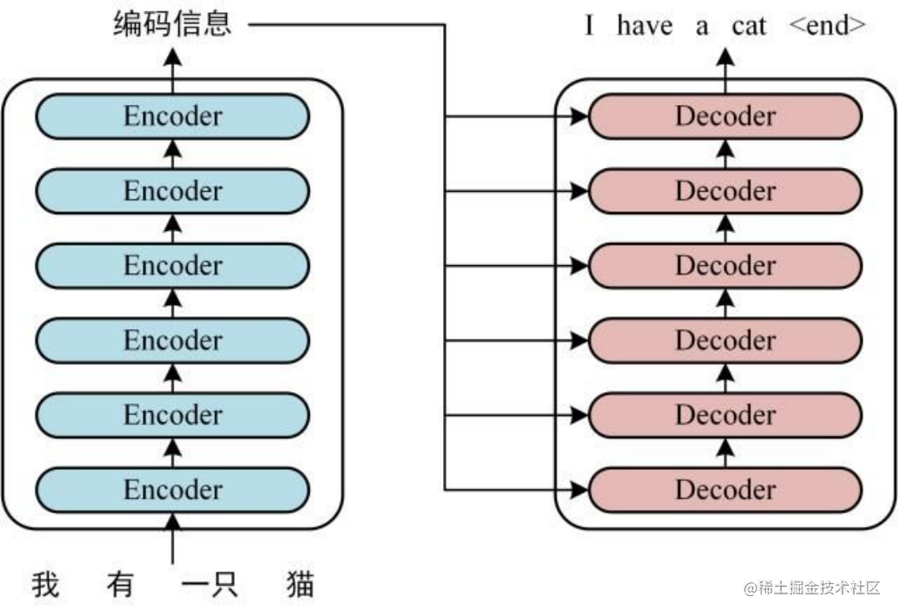
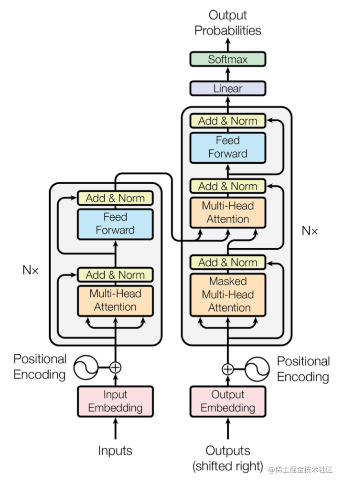
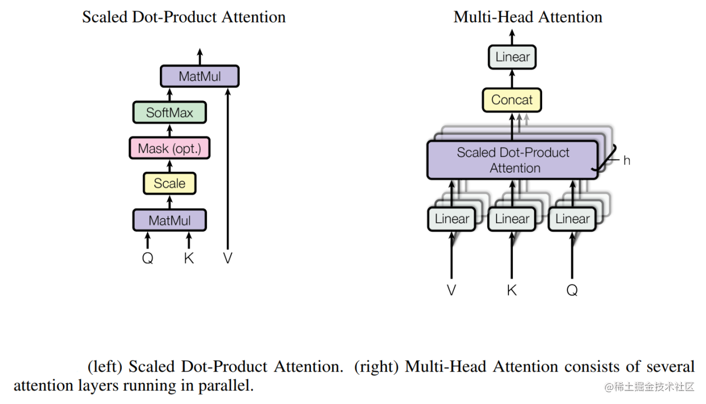
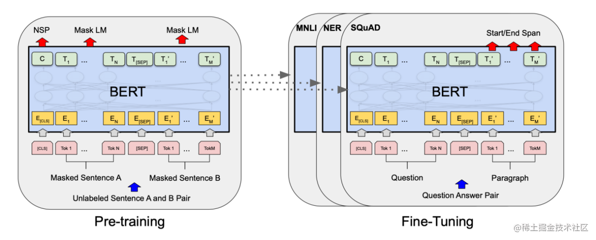
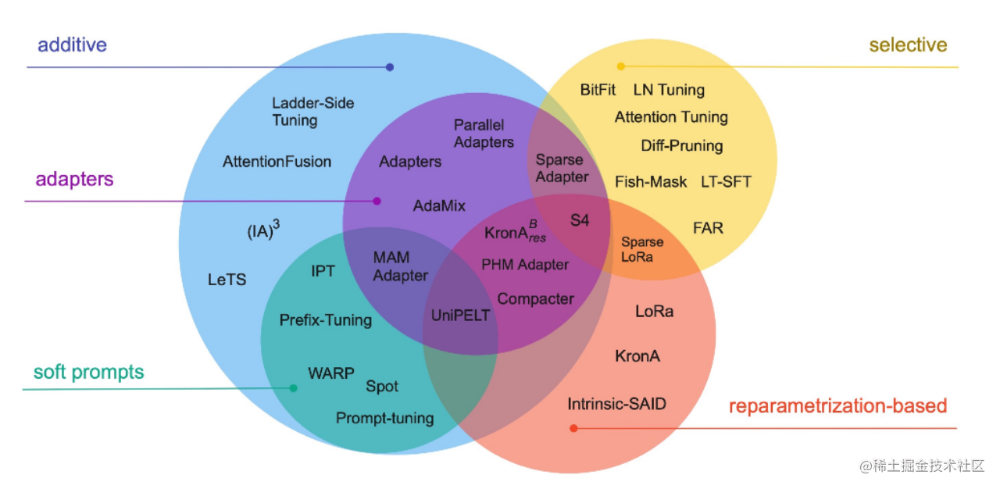

# 大模型参数高效微调技术原理综述（一）-背景、参数高效微调简介

随着，ChatGPT 迅速爆火，引发了大模型的时代变革。然而对于普通大众来说，进行大模型的预训练或者全量微调遥不可及。由此，催生了各种参数高效微调技术，让科研人员或者普通开发者有机会尝试微调大模型。

因此，该技术值得我们进行深入分析其背后的机理，本系列大体分七篇文章进行讲解。

- [大模型参数高效微调技术原理综述（一）-背景、参数高效微调简介](https://zhuanlan.zhihu.com/p/635152813)
- [大模型参数高效微调技术原理综述（二）-BitFit、Prefix Tuning、Prompt Tuning](https://zhuanlan.zhihu.com/p/635686756)
- [大模型参数高效微调技术原理综述（三）-P-Tuning、P-Tuning v2](https://zhuanlan.zhihu.com/p/635848732)
- [大模型参数高效微调技术原理综述（四）-Adapter Tuning及其变体](https://zhuanlan.zhihu.com/p/636038478)
- [大模型参数高效微调技术原理综述（五）-LoRA、AdaLoRA、QLoRA](https://zhuanlan.zhihu.com/p/636215898)
- [大模型参数高效微调技术原理综述（六）-MAM Adapter、UniPELT](https://zhuanlan.zhihu.com/p/636362246)
- [大模型参数高效微调技术原理综述（七）-最佳实践、总结](https://zhuanlan.zhihu.com/p/649755252)

## 背景

目前，基于 [Transformers](https://zhida.zhihu.com/search?content_id=229276452&content_type=Article&match_order=1&q=Transformers&zhida_source=entity) 架构的大型语言模型 (LLM)，如 GPT、T5 和 [BERT](https://zhida.zhihu.com/search?content_id=229276452&content_type=Article&match_order=1&q=BERT&zhida_source=entity)，已经在各种自然语言处理 (NLP) 任务中取得了 SOTA 结果。此外，还开始涉足其他领域，例如：计算机视觉 (VIT、Stable Diffusion、LayoutLM) 和音频 (Whisper、XLS-R)。

将预训练好的语言模型（LM）在下游任务上进行微调已成为处理 NLP 任务的一种范式。与使用开箱即用的预训练 LLM (例如：零样本推理) 相比，在下游数据集上微调这些预训练 LLM 会带来巨大的性能提升。

但是，随着模型变得越来越大，在消费级硬件上对模型进行全部参数的微调（full fine-tuning）变得不可行。

此外，为每个下游任务独立存储和部署微调模型变得非常昂贵，因为微调模型（调整模型的所有参数）与原始预训练模型的大小相同。

因此，近年来研究者们提出了各种各样的参数高效迁移学习方法（Parameter-efficient Transfer Learning），即固定住Pretrain Language model（PLM）的大部分参数，仅调整模型的一小部分参数来达到与全部参数的微调接近的效果（调整的可以是模型自有的参数，也可以是额外加入的一些参数）。

## **Tansformer**

上面谈到当前主流大语言模型都是基于 Transformers 架构，下面我们来详细看看 Transformers 架构内部构造。

Transformer（论文：**Attention is All You Need**）是谷歌在 2017年的提出的，它针对RNN的弱点进行重新设计，解决了RNN效率问题和传递中的缺陷等，在很多问题上都超过了RNN的表现。

Transformer 的整体结构如下图所示，图中 Transformer 用于中英文翻译。可以看到，Transformer 由 Encoder 和 Decoder 两个部分组成，Encoder 和 Decoder 都包含 6 个 block。

image.png

而 Transformer 的内部结构如下图，左侧为 Encoder block，右侧为 Decoder block。 可以看到 Encoder block 包含一个 Multi-Head Attention（Multi-Head Attention是由多个 Self-Attention组成的），而 Decoder block 包含两个 Multi-Head Attention (其中，有一个用到 Masked)。Multi-Head Attention 上方还包括一个 Add & Norm 层，Add 表示残差连接 (Residual Connection) 用于防止网络退化，Norm 表示 Layer Normalization，用于对每一层的激活值进行归一化。

image.png

而 Transformer 的核心就是自注意力（Self-Attention）。引入Self Attention后会更容易捕获句子中长距离的相互依赖的特征，因为如果是RNN或者LSTM，需要依次序序列计算，对于远距离的相互依赖的特征，要经过若干时间步步骤的信息累积才能将两者联系起来，而距离越远，有效捕获的可能性越小。但是Self Attention在计算过程中会直接将句子中任意两个单词的联系通过一个计算步骤直接联系起来，所以，远距离依赖特征之间的距离被极大缩短，有利于有效地利用这些特征。除此之外，Self Attention 对于增加计算的并行性也有直接帮助作用。

而**多头注意力的机制**则进一步细化了注意力层，多头注意力是由多个自注意力组成。它通过以下两种方式提高了注意力层的性能：

- 扩展了模型专注于不同位置的能力。当多头注意力模型和自注意力机制集合的时候，比如：我们翻译“动物没有过马路，因为它太累了”这样的句子的时候，我们想知道“它”指的是哪个词，如果能分析出来代表动物，就很有用。
- 为注意力层提供了多个“表示子空间”。对于多头注意力，我们有多组Query/Key/Value权重矩阵，这些权重矩阵集合中的每一个都是随机初始化的。然后，在训练之后，每组用于将输入Embedding投影到不同的表示子空间中。多个head学习到的Attention侧重点可能略有不同，这样给了模型更大的容量。

Self-Attention和 Multi-Head Attention 的内部结构如下所示：

image.png

总之，Transformer 架构的提出，奠定了其作为当前大模型领域主流的算法架构的基础。它不仅让模型能够支持更大的容量，使得模型参数能够轻松突破达到上亿规模。同时，还能够使模型较好地并行训练（Token并行、张量并行、流水线并行）。

## **Bert**

随着Transformer在2017年发布后，2018年谷歌又发布了BERT（论文：**BERT: Pre-training of Deep Bidirectional Transformers for Language Understanding**），一经面世便一举击败 11 个 NLP 任务的 State-of-the-art (Sota)结果，成为了 NLP 界新的里程碑；

Bert的结构如下图所示，左边是Bert模型预训练过程，右边是对于具体任务的微调过程。 其中，微调阶段是后续用于一些下游任务的时候进行微调，例如：文本分类，词性标注，问答系统等，BERT 无需调整结构就可以在不同的任务上进行微调。通过”预训练语言模型 + 下游任务微调”的任务设计，带来了强大的模型效果。从此，“预训练语言模型 + 下游任务微调”便成为了 NLP 领域主流训练范式。

image.png

## **全量参数微调与参数高效微调对比**

上面提到以BERT模型为代表的“预训练语言模型 + 下游任务微调”训练模式成为了自然语言处理研究和应用的新范式。此处的下游任务微调是基于模型全量参数进行微调。

但是，以 [GPT3](https://zhida.zhihu.com/search?content_id=229276452&content_type=Article&match_order=1&q=GPT3&zhida_source=entity) 为代表的预训练语言模型（PLM）参数规模变得越来越大，这使得在消费级硬件上进行全量微调变得不可行。

下表展示了在一张A100 GPU（80G 显存）以及 CPU 内存 64GB以上的硬件上进行模型全量微调以及参数高效微调对于 CPU/GPU 内存的消耗情况。

| 模型名                          | 全量参数微调             | PEFT-LoRA （PyTorch）   | PEFT-LoRA（[DeepSpeed+CPU Offloading技术](https://zhida.zhihu.com/search?content_id=229276452&content_type=Article&match_order=1&q=DeepSpeed%2BCPU+Offloading技术&zhida_source=entity)） |
| ------------------------------- | ------------------------ | ----------------------- | ------------------------------------------------------------ |
| bigscience/T0_3B (3B 参数)      | 47.14GB GPU / 2.96GB CPU | 14.4GB GPU / 2.96GB CPU | 9.8GB GPU / 17.8GB CPU                                       |
| bigscience/bloomz-7b1 (7B 参数) | OOM GPU                  | 32GB GPU / 3.8GB CPU    | 18.1GB GPU / 35GB CPU                                        |
| bigscience/mt0-xxl (12B 参数)   | OOM GPU                  | 56GB GPU / 3GB CPU      | 22GB GPU / 52GB CPU                                          |

除此之外，模型全量微调还会损失多样性，存在灾难性遗忘的问题。

因此，如何高效的进行模型微调就成了业界研究的重点，这也为参数高效微调技术的快速发展带来了研究空间。

## **高效参数微调**

参数高效微调是指微调少量或额外的模型参数，固定大部分预训练模型（LLM）参数，从而大大降低了计算和存储成本，同时，也能实现与全量参数微调相当的性能。参数高效微调方法甚至在某些情况下比全量微调效果更好，可以更好地泛化到域外场景。

高效微调技术可以粗略分为以下三大类：增加额外参数（A）、选取一部分参数更新（S）、引入重参数化（R）。而在增加额外参数这类方法中，又主要分为类适配器（Adapter-like）方法和软提示（Soft prompts）两个小类。

image.png

常见的参数高效微调技术有BitFit、Prefix Tuning、Prompt Tuning、P-Tuning、Adapter Tuning、LoRA等，后续文章将对一些主流的参数高效微调方法进行讲解。